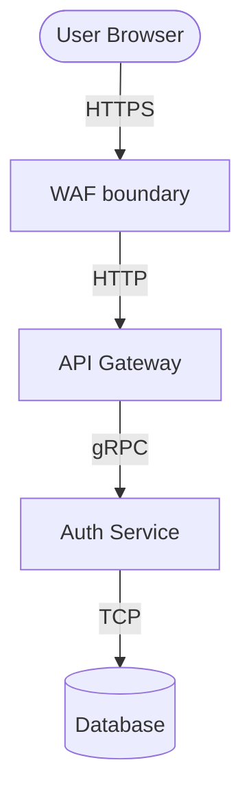

## When To Use
Triggered on a proposed architecture or new feature before the developer agent writes code.

## Context To Load First
1. The feature spec.
2. `ARCHITECTURE_RULES.md`
3. `DOMAIN_DICTIONARY.md`

## Process
1. Walk through the feature's architecture to identify all Trust Boundaries (where data moves from an untrusted to a trusted zone).
2. Generate a `mermaid` Data Flow Diagram (DFD) visualizing the components and boundaries.
3. Systematically apply the STRIDE methodology (Spoofing, Tampering, Repudiation, Information Disclosure, Denial of Service, Elevation of Privilege) across every boundary.
4. Output the Threat Model Report, blocking development until high-risk gaps are mitigated.

## Output Format
`.claude/feature-workspace/threat-model.md`

```markdown
# Visual Threat Model: [Feature]

## Data Flow Diagram


## STRIDE Findings

| Threat | Boundary | Vulnerability Details | Mitigation Strategy |
|---|---|---|---|
| Spoofing | API->Auth | Token signature could be easily bypassed if unverified | Require JWT standard validation in library |

## Mitigations to Enforce
- [Specific invariant for the Security Reviewer to check later]
```

## Guardrails
- Threat models must include the visual `mermaid` representation.
- Automatically highlight trust boundaries visually.
- Do not stop at "Information Disclosure". Specify exactly *what* PII is at risk.
