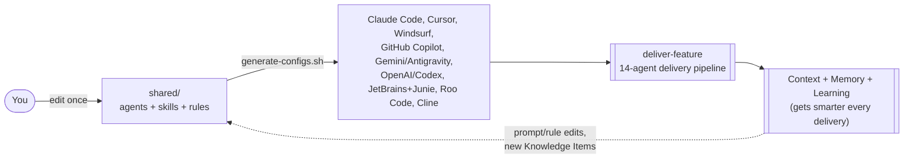
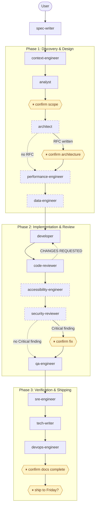

# AI Assistant Dot Files — Context Engineering Framework

[](https://github.com/orieken/ai-assistant-dot-files/actions/workflows/framework-ci.yml)

One canonical set of agents, skills, and rules — written once in `shared/`, generated or symlinked into
whatever AI coding tool you actually use (Claude Code, Cursor, Windsurf, GitHub Copilot, Gemini Antigravity,
OpenAI/Codex, JetBrains AI Assistant + Junie, Roo Code, Cline). Edit `shared/`, run one script, every tool stays in sync — no more hand-copying the same
instructions into five different config formats.

This also ships a full multi-agent **feature delivery pipeline** (spec → analysis → architecture →
implementation → review → security → QA → docs → deploy) built around Clean Architecture, TDD, and the
craftsmanship principles of Robert C. Martin, Martin Fowler, Kent Beck, and Neal Ford.

For deeper detail beyond this README:
- [docs/ARCHITECTURE.md](docs/ARCHITECTURE.md) — the `shared/` layer design, tier system, context flow
- [docs/AGENT_REFERENCE.md](docs/AGENT_REFERENCE.md) — every agent's role and what actually checks its work today
- [docs/CONTRIBUTING.md](docs/CONTRIBUTING.md) — how to add a new agent, skill, rule, or platform
- [docs/runbooks/](docs/runbooks/) — operational guides, including adding a platform and editing agent prompts
- [docs/MIGRATION.md](docs/MIGRATION.md) — upgrading a pre-restructure ("v1") checkout to the canonical `shared/` layer ("v2")

---

## The Framework at a Glance



One canonical source, nine tools kept in sync automatically, one governed pipeline, and a feedback loop that
improves the framework itself over time — see [context-engineering.md](docs/runbooks/context-engineering.md)
for how the Context/Memory/Learning loop actually works, and the pipeline diagram further down for the full
14-agent sequence.

---

## Architecture (Shared Layer → Platform Configs → Project Install)

```
shared/                              <- single source of truth, edit here only
├── agents/        (39 agents)       <- .md with YAML frontmatter, versioned (CHANGELOG.md)
├── skills/        (68 skills)       <- .md with trigger keywords/patterns
├── rules/                           <- architecture-guardrails.md, design-principles.md, approval-gates.md
├── contracts/                       <- required-section contracts for pipeline agent handoffs
├── knowledge/                       <- portable Knowledge Items (KIs)
├── templates/                       <- tutorial/scaffold content, e.g. my-first-feature.md
├── ARCHITECTURE_RULES.md
├── DOMAIN_DICTIONARY.md
├── TEAM_TOPOLOGY.md               <- Bounded Context -> team/type/interaction-mode registry (Skelton & Pais)
├── memory-registry.json           <- catalog of every durable memory source + retrieval backend
└── platform-registry.json           <- tier/capability/format per platform

        │  scripts/generate-configs.sh (reads shared/ + platform-registry.json)
        ▼

Generated / symlinked platform configs (this repo, or any target project via install.sh)
├── .claude/{agents,rules,skills}/    -> symlinks to shared/ (Tier 1: Full)
├── .cursor/rules/*.mdc               <- generated, rules inlined (Tier 2: Personas + Rules)
├── .windsurfrules                    <- generated, flat (Tier 2)
├── .github/copilot-instructions.md   <- generated (Tier 2), + .github/instructions/*.instructions.md
├── AGENTS.md                          <- generated (confirmed read by Gemini Antigravity)
├── .agents/{skills,rules}/            <- symlinks to shared/ (project installs; ~/.gemini/config/skills/ for --global)
└── .openai.md                        <- generated (Tier 3)

        │  install.sh --global | --project <path>
        ▼

Your machine (~/) or a target project — agents/skills/rules active in every AI tool you use
```

`scripts/check-parity.sh` verifies every generated config actually matches the canonical `shared/` source —
run it after any edit to `shared/` before trusting the generated files are current.

---

## Quick Start

```bash
git clone <this-repo> ai-assistant-dot-files
cd ai-assistant-dot-files

# See what would happen first, without touching anything
./install.sh --global --dry-run

# Install globally (symlinks shared/ into ~/.claude, ~/.cursor, etc. — always current after a git pull)
./install.sh --global

# Or install into one specific project (also symlinked by default -- see note below)
./install.sh --project /path/to/your-project

# Verify everything is wired correctly
scripts/check-parity.sh
```

Both `--global` and `--project` auto-detect which of the six platforms you actually have installed and only
generate configs for those (`--platform <name>` to force a single one), and both **symlink by default** —
a `--project` install still depends on this repo's checkout staying where it is, exactly like `--global`
does. Pass `--copy` if you want a project install that's a real, independent copy instead (also required on
Windows without WSL, where symlinks need elevated permissions). Add `--tour` to either mode to run the
`onboard` skill walkthrough right after install.

Once installed:
```bash
# Claude Code: agents are native subagents, skills are slash commands
claude
> /new-feature "password reset via email"       # interview + spec
> /deliver-feature features/password-reset.md   # full pipeline

# Any other tool: agents are personas, invoke by @-tagging or referencing the file
> Act as the code-reviewer persona from shared/agents/code-reviewer.md and review my current changes.
```

**Version marker** — every non-dry-run install writes `.claude/framework-install.json` into the
target (or `~/.claude/` for `--global`). It records the installed git tag, commit SHA, install
date, mode (symlink/copy), and framework level. `health-check.sh` reads this marker when invoked
from within an installed project and reports a WARN if the source repo has moved ahead — making
drift from `--copy` installs visible without manual archaeology. Pre-v3.3 installs have no marker;
the legacy forensic detection in `docs/prompts/update-installed-framework.md` remains the fallback.

To remove: `./uninstall.sh --global` (or `--project <path>`) restores whatever was backed up during install (and removes the version marker).

---

## Enterprise Memory Sync

Teams using this framework across multiple repositories can share Knowledge Items (KIs) via an organization-owned `knowledge-hub` git repo. See [ADR-003](docs/adrs/ADR-003-enterprise-memory-sync.md) for the full design rationale.

**Setup** — create `.claude/sync-config.yaml` at the root of your framework checkout:

```yaml
memory_sync:
  org_repo: git@github.com:<your-org>/knowledge-hub.git
  cache_dir: ~/.claude/sync-cache
  push_pr_base: main
```

**Pull** — diff org KIs into your local `shared/knowledge/` (dry run first, then apply):

```bash
./install.sh --sync-memory               # preview changes
./install.sh --sync-memory pull --confirm  # apply
```

**Push** — promote mature `.claude/knowledge/` KIs (>30 days old) to the org repo via PR:

```bash
./install.sh --sync-memory push             # preview candidates
./install.sh --sync-memory push --confirm   # open PR (requires gh CLI for GitHub)
```

**Conflict rules**: `shared/knowledge/` → org repo wins on pull. `.claude/knowledge/` → local always wins (project KIs are never overwritten). Name collisions between org and project KIs halt the pull until resolved manually.

**Auth**: SSH is primary. For enterprises where SSH is disabled, set `MEMORY_SYNC_TOKEN=<pat>` in the environment — the script converts the SSH URL to HTTPS automatically.

---

## Platform Capability Matrix

| Platform | Tier | Capability | Format | Terminology |
|---|---|---|---|---|
| **Claude Code** | 1 — Full | Agents (tool access, autonomous process, pipeline participation), skills, rules, hooks, subagent orchestration | Markdown + YAML frontmatter, symlinked from `shared/` | Agent |
| **Cursor** | 2 for rules; agents/skills now Tier-1-equivalent (confirmed 2026-07-06) | Real subagent + skill loading via `.cursor/agents/`/`.cursor/skills/` (symlinked to `shared/`, zero-drift, same mechanism as Claude Code) — no `tools:` allowlist though, subagents inherit all parent tools with only a coarse `readonly` flag. Rules still fully inlined, no orchestration at that layer | `.cursor/agents/`, `.cursor/skills/` — direct symlinks to `shared/`. Rules: `.mdc` per concern (11: `architecture`, `design-principles`, `approval-gates`, `agent-roster`, `testing`, `go-backend`, `vue-frontend`, `typescript-conventions`, `python-conventions`, `csharp-conventions`, `java-conventions`), YAML frontmatter, content inlined (Cursor Rules still can't follow file references). Only `approval-gates.mdc`/`agent-roster.mdc` are `alwaysApply`; the rest Auto Attach on relevant file globs to stay near Cursor's own ~2,000-token always-apply budget | Agent (`.cursor/agents/`) / Persona (`.cursor/rules/`) |
| **Windsurf** | 2 — Personas + Rules | Same as Cursor | Single flat `.windsurfrules`, inlined | Persona |
| **GitHub Copilot** | 2 — Personas + Rules | Repo-wide instructions + path-scoped rule files (confirmed via [GitHub's docs](https://docs.github.com/en/copilot/how-tos/configure-custom-instructions-in-your-ide/add-repository-instructions-in-your-ide), 2026-07) | `.github/copilot-instructions.md` (roster + rules inlined) **plus** 7 scoped `.github/instructions/*.instructions.md` files (`testing`, `go-backend`, `vue-frontend`, `typescript-conventions`, `python-conventions`, `csharp-conventions`, `java-conventions`) with `applyTo` globs — all combine | Persona |
| **JetBrains AI Assistant + Junie** | 2 — Personas + Rules | Project-rules with IDE-configurable scoping (Always / By file patterns / By model decision / Manually). Junie (agentic mode) reads `.junie/guidelines.md` first, then falls back to root `AGENTS.md` (already generated). No custom modes or skill invocation. Files travel with the project — works in IntelliJ IDEA, WebStorm, Rider, etc. Confirmed via jetbrains.com/help/ai-assistant and junie.jetbrains.com/docs (2026-07-30) | `.aiassistant/rules/` (10 files: 4 always-active, 6 with IDE mode hint for file-pattern scoping) + `.junie/guidelines.md` — generated by `scripts/generate-configs.sh --platform jetbrains` | Persona |
| **Roo Code** | 2 — Personas + Modes | All 37 shared agents map to Roo Code custom modes with per-mode tool access scoping (`read`, `edit`, `command`, `mcp`, `browser` groups derived from agent `tools:` field). Global framework rules in `.roo/rules/` apply to all modes. No skill invocation, no pipeline orchestration. Confirmed format via docs.roocode.com (2026-07-30) | `.roomodes` (YAML, 37 custom modes) + `.roo/rules/*.md` — generated by `scripts/generate-configs.sh --platform roo-code` | Mode (agent-like persona with tool scoping) |
| **Cline** | 2 — Personas + Rules | Plain markdown rules directory; optional `paths:` frontmatter for file-scoped activation. No custom modes or agent equivalent. Also reads `~/.agents/AGENTS.md` (cross-tool convention) | `.clinerules/` (10 files: 4 always-active, 6 path-scoped by language/test) — generated by `scripts/generate-configs.sh --platform cline` | Persona |
| **Gemini (Antigravity)** | 3 (rules) + confirmed real skill invocation | **Confirmed 2026-07-02** ([results](tests/platform-verification/results/)): reads `AGENTS.md` for rules, genuinely invokes (not just describes) skills from `.gemini/config/skills/` (global) or `.agents/skills/` (project). The old `.gemini/antigravity/instructions.md` guess was confirmed unread and removed | `AGENTS.md`, `~/.gemini/config/skills/` (global) or `.agents/skills/`/`.agents/rules/` (project), symlinked to `shared/` | Persona |
| **OpenAI / Codex** | 3 — System Prompt | Single instruction file only | `.openai.md`, inlined | Persona |

Full definitions of **Agent**, **Persona**, and **Capability Tier** live in `DOMAIN_DICTIONARY.md`. The
short version: only Tier 1 has real multi-step agent orchestration with tool access; Tiers 2/3 get the same
underlying knowledge as a **persona** — a context frame with no autonomous pipeline participation — because
that's what those tools are actually capable of running.

---

## Agent Roster (26)

Full definitions in `shared/agents/`; versions tracked in `shared/agents/CHANGELOG.md`. For what actually
checks each agent's work today (a contract, a downstream reviewer, a human approval gate, or an honestly
documented gap), see [docs/AGENT_REFERENCE.md](docs/AGENT_REFERENCE.md).

| Agent | What it does |
|---|---|
| **spec-writer** | Interviews the user to build a complete feature spec, critiques its own readiness before it enters the pipeline. |
| **product-owner** | Challenges scope and ROI before any code is written — maximizes work *not* done. |
| **context-engineer** | Pre-flight context optimizer: scopes the bounded context, pins files, surfaces KIs/ADRs, estimates token budget, auto-prunes out-of-context files. |
| **analyst** | First pipeline step. Turns a feature spec into acceptance criteria, task breakdown, data model/API changes, and a definition of done. |
| **architect** | Structural decisions, fitness functions, layer boundaries — for features that need them. Writes RFCs for boundary-crossing changes. |
| **performance-engineer** | Shift-left performance review of the architecture before implementation starts — N+1 prevention, timeouts, caching. |
| **data-engineer** | Schema design and zero-downtime (Expand/Contract) migrations for features touching the database. |
| **developer** | Implements the feature via TDD, runs in an isolated worktree, iterates with code-reviewer until approved. |
| **code-reviewer** | Reviews for SOLID/clean-code violations; sends work back with named refactoring instructions until approved. |
| **accessibility-engineer** | Reviews UI changes for semantic HTML and WCAG compliance before code-review passes to security. |
| **security-reviewer** | STRIDE threat model of the implementation; fixes Critical/High findings directly rather than just recommending. |
| **qa-engineer** | Writes and runs tests covering every acceptance criterion and edge case; fixes bugs it finds. |
| **sre-engineer** | Observability review — SLIs, OTel spans, structured logging, PII hygiene. |
| **tech-writer** | Updates all documentation for the delivered feature. |
| **devops-engineer** | CI/CD, environment config, deployment — the final pipeline agent. |
| **dependency-auditor** | Audits the dependency tree for vulnerabilities, license issues, and unused packages. |
| **release-manager** | Semantic version bump, changelog, and deployment checklist from git history. |
| **chaos-engineer** | Designs fault-injection experiments to verify resilience patterns actually work. |
| **dx-engineer** | Developer-experience: build times, flaky tests, local dev loop friction. |
| **finops-engineer** | Reviews architecture/code changes for cost implications as a first-class metric. |
| **documentation-manager** | Ad-hoc-session counterpart to `promote-memory` -- captures durable knowledge from sessions that never went through `deliver-feature`, via the same Candidate Record + human-approval flow. |
| **memory-auditor** | Read-only counter-agent for the KI corpus — audits schema compliance, duplicate candidates, and stale metadata without modifying memory. |
| **modernization-supervisor** | Coordinates parallel legacy-modernization workstreams (dependencies, patterns, test coverage). |
| **api-test-generator** | Generates Sunday Framework API test suites (Playwright + Vitest + Zod) from a spec. |
| **test-driven-developer** | Autonomous red-green-refactor loop: writes tests first, iterates until green. |
| **unit-tester** | Backfills unit and characterization tests for existing code without modifying production implementation. |

---

## Skill Catalog (58)

Full definitions in `shared/skills/<name>/SKILL.md`, including exact trigger keywords/intent patterns.
Grouped by what they're for:

### Pipeline orchestration
| Skill | Trigger on |
|---|---|
| `deliver-feature` | "Deliver \*", "Implement \*", `/deliver-feature *` — runs the full agent sequence |
| `deliver-atdd` | Acceptance-test-first delivery loop with scenario review gates and autonomous red-green implementation. |
| `resume-pipeline` | Resuming an interrupted run, `--from-phase N`, rolling back an agent's artifact |
| `validate-artifact` | Auto-invoked between every contract-bound agent handoff — checks required sections |
| `pipeline-trace` | "How long did \* take", ad-hoc single-run timing/iteration questions |
| `pipeline-retrospective` | Cross-delivery trend analysis — is an agent getting slower or more retried over time |
| `agent-scorecard` | Monthly quality scoring per agent (security TPR, first-pass acceptance, completeness, fitness coverage) |
| `agent-eval` | Acts as an agent against its `tests/agents/` fixture and grades the output against a qualitative rubric — the automated, LLM-as-judge half of prompt regression testing |
| `retrospective` | "How did \* go?" — single-delivery narrative, auto-invoked every 5th delivery |
| `extract-lessons` | Cross-delivery pattern extraction — recurring findings that should become rules/prompt changes/KIs |
| `context-audit` | Context waste analysis — unused pins, duplicates, unconstrained large reads |
| `summarize-artifact` | Condensing an older pipeline artifact for a downstream agent (context decay) |
| `search-ki` / `create-ki` | Searching/authoring Knowledge Items in `shared/knowledge/` |
| `query-memory` | Registry-aware search across *every* memory source (KIs/ADRs plus feature archive, glossary, topology), not just KIs/ADRs |
| `memory-engineer` | Periodic sweep of the KI corpus for duplicates and expiration candidates; keeps `shared/memory-registry.json` accurate |
| `promote-memory` | Evaluates one delivery's `retrospective.md` immediately for promotion-worthy content — KI, ADR, rule change, or lesson |

### Feature lifecycle
| Skill | Trigger on |
|---|---|
| `onboard` | "I'm new here", "give me a tour", `/onboard` — new-user walkthrough, ends at `shared/templates/my-first-feature.md` |
| `new-feature` | Guided spec creation, optionally kicks off delivery |
| `spec-writer` | `/spec-writer`, "write a spec for \*", "review this spec" |
| `event-storm` | Collaborative domain modeling before a feature starts |
| `bootstrap-project` | Guided greenfield project setup from known ecosystem blueprints and starter artifacts. |

### Code quality & architecture
| Skill | Trigger on |
|---|---|
| `analyze-complexity` / `complexity-check` | Cyclomatic complexity / function length audits |
| `design-review` | Standalone design critique of any file |
| `refactor-to-pattern` | Rewriting procedural code into a named GoF/Enterprise pattern |
| `check-ubiquitous-language` | Flags synonym drift against `DOMAIN_DICTIONARY.md` |
| `verify-dependencies` | Clean Architecture import-boundary checks |
| `team-topology-check` | Flags a stale Collaboration mode or a bypassed Platform team at a Bounded Context crossing, per `TEAM_TOPOLOGY.md` |
| `review-pr` | Coordinates code-reviewer + security-reviewer + accessibility-engineer on a PR |
| `context-engineer` | Builds a high-signal context manifest before complex, unfamiliar, or multi-file work. |

### Testing
| Skill | Trigger on |
|---|---|
| `run-tests` | Executes the suite, verifies the 85% coverage threshold |
| `generate-fuzz-tests` | Property-based fuzz test generation |
| `sunday-test-advisor` | Audits an API spec for missing test scenarios |
| `saturday-test-advisor` | Audits Saturday Site-Centric E2E/UI suites for orphaned primitives and broken scenario references. |
| `debug-tests` | Iteratively debugging a failing test suite |
| `api-contract-verify` | Pact-style consumer-driven contract verification |
| `backfill-unit-tests` | Coordinates `unit-tester` and `code-reviewer` to add tests around existing code safely. |

### Security & accessibility
| Skill | Trigger on |
|---|---|
| `check-accessibility` | Semantic HTML / a11y violation scan |
| `threat-model` | STRIDE + Data Flow Diagram before development starts |

### Data & migrations
| Skill | Trigger on |
|---|---|
| `db-migration` | Zero-downtime Expand/Contract migration design |
| `validate-migrations` | Rejects destructive migration operations |

### API design
| Skill | Trigger on |
|---|---|
| `openapi` | API contract design before implementation |
| `api-ingest` | Generates docs + typed clients from a Swagger/OpenAPI URL |
| `mcp-add` | Retrofitting or extending an MCP server with the framework's tool/persona/workflow pattern. |

### Documentation
| Skill | Trigger on |
|---|---|
| `adr` / `badr` | Architecture Decision Records (technical / business-case) |
| `scaffold-docs` | Comprehensive implementation guide generation |

### Operations & incident response
| Skill | Trigger on |
|---|---|
| `on-call` | Active incident response |
| `five-whys` | Structured root cause analysis |
| `chaos-experiment` | Game Day fault injection design |
| `health-check` | Validates this installation — symlinks, frontmatter, config drift |
| `debug-environment` | Systematic environment/config debugging |
| `performance-profile` | Diagnosing *why* something is slow |
| `dependency-update` | Safe, structured monorepo dependency updates |

### Domain-specific / utility
| Skill | Trigger on |
|---|---|
| `numpath-alignment` / `numpath-strategy` | NumPath research-project theoretical grounding checks |
| `list-agents` | Lists configured custom agents in `.claude/` |

---

## AI Feature Team Pipeline



Dashed-border agents (`architect`, `performance-engineer`, `data-engineer`, `accessibility-engineer`,
`security-reviewer`) are **conditional** — each runs only if its own trigger condition is met (a new
pattern/abstraction, a performance SLA, a data model change, a UI surface, a security surface
respectively); skipped otherwise, straight through to the next mandatory step. Amber nodes are **real
stops** — the pipeline doesn't proceed past one without your explicit confirmation. Every arrow is also
gated by `validate-artifact` (structural contract check) where the producing agent has a contract in
`shared/contracts/`, and the whole run is checkpointed to `.claude/feature-workspace/pipeline-state.json`
+ `pipeline-trace.json` so it can be resumed or rolled back (`resume-pipeline`) rather than restarted from
scratch.

### Using the agents by tool

**Claude Code (native support)** — agents are real subagents with tool access:
```bash
claude
> /new-feature "user authentication"
> /deliver-feature features/user-authentication.md
```

**Cursor / Windsurf** — agents are personas; reference the file directly:
```
Act exactly as described in shared/agents/developer.md. Read .claude/feature-workspace/analysis.md
and implement the feature.
```

**GitHub Copilot** — same idea, tag the file:
```
Act as the Code Reviewer persona from #file:shared/agents/code-reviewer.md. Review my current
workspace changes against ARCHITECTURE_RULES.md.
```

### Auditing an existing codebase

Most skills don't require a full feature delivery — they work standalone against any file or directory:
```bash
> /design-review src/utils/payment-processor.ts
> /threat-model src/api/checkout.ts
> /complexity-check src/core/
> /chaos-experiment src/services/database.ts
> /refactor-to-pattern "Rewrite this switch statement as Strategy" src/parsers/document.ts
```

---

## Core Craftsmanship Principles Enforced

- **TDD/BDD (Kent Beck)**: Red-Green-Refactor, tests drive design.
- **Clean Code & SOLID (Uncle Bob)**: cyclomatic complexity < 7, functions < 30 LOC.
- **Evolutionary Architecture (Neal Ford & Martin Fowler)**: high cohesion, loose coupling, named refactorings.
- **YAGNI & KISS**: no speculative abstraction.
- **The Boy Scout Rule**: leave touched files cleaner than you found them.
- **Security & Observability**: no hardcoded secrets, OTel by default, structured low-cardinality logging.

Full rules: `shared/rules/architecture-guardrails.md`, `shared/rules/design-principles.md`,
`shared/rules/approval-gates.md`, `ARCHITECTURE_RULES.md`, `DOMAIN_DICTIONARY.md`.

---

## IDE Setup (optional) — schema-backed frontmatter autocomplete

Agent, skill, and Knowledge Item frontmatter blocks have JSON Schemas under `shared/schemas/`. Opting
in gets you autocomplete and inline validation while authoring — for example, `tools: WhatEverRandomName`
gets flagged in-editor instead of only at `scripts/health-check.sh` time (which today validates field
presence only, not values).

**VS Code** — install the [Red Hat YAML extension](https://marketplace.visualstudio.com/items?itemName=redhat.vscode-yaml)
(`redhat.vscode-yaml`), then copy the template:

```bash
cp .vscode/settings.json.example .vscode/settings.json
```

**Cursor** — same setup, Cursor uses the same YAML language server:

```bash
cp .cursor/settings.json.example .cursor/settings.json
```

Both templates wire `shared/schemas/agent-frontmatter.schema.json`, `skill-frontmatter.schema.json`,
and `ki-frontmatter.schema.json` to the matching glob patterns under `shared/`. The contracts these
schemas encode live under `shared/contracts/`.

---

## License

Dual-licensed by content type:
- **Code** (`scripts/`, `install.sh`, `uninstall.sh`) — [MIT](LICENSE).
- **Prompt/instructional content** (`shared/agents/`, `shared/skills/`, `shared/rules/`, `shared/knowledge/`,
  `docs/`, top-level blueprint files) — [CC BY 4.0](LICENSE-CONTENT.md).

If you copy or adapt an agent, skill, or rule from this repo, keep the attribution — see
[LICENSE-CONTENT.md](LICENSE-CONTENT.md) for the exact wording. Every agent, skill, and rule file also
carries this attribution at the bottom of the file itself, so it travels with the file if it's copied out on
its own.
