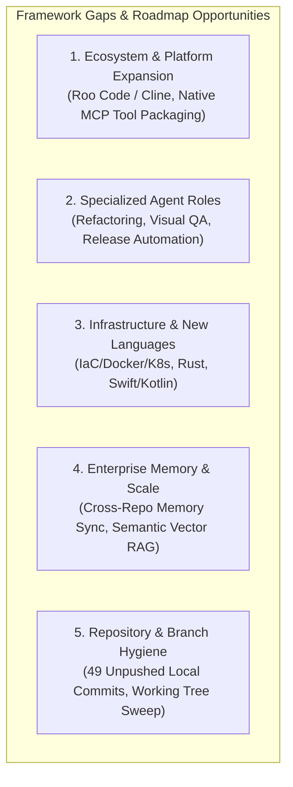

# Framework Gap Audit — 2026-07-25

Ad-hoc audit of current framework health, capability gaps, and roadmap priorities for the Context Engineering Framework (`ai-assistant-dot-files`) after reviewing repository structure, execution traces, and recent context-engineering guidance.

---

## 1. Executive Summary & Framework Health

* **Canonical Layer**: Single source of truth in [`shared/`](file:///Users/oscarrieken/Projects/Rieken/ai-assistant-dot-files/shared) across 36 agents, 65 skills, 9 rule suites, 12 contracts, memory registry, and project patterns.
* **Multi-Platform Capability Tiers**: Full Tier 1 support for Claude Code; Tier 2/1 hybrid for Cursor; Tier 2 for Windsurf and GitHub Copilot; Tier 3 for Gemini Antigravity and OpenAI Codex.
* **Automated Parity & CI Verification**: All 41 Epics across Phases 1–9 are complete. `scripts/ci-check.sh` passes 100% clean across parity diffing, agent prompt golden-file tests, structural health checks, and 6-platform install matrix validation.

---

## 2. Strategic Gap Analysis (5 Key Dimensions)

### Dimension 1: Next-Gen Platform & Tool Ecosystems
* **Roo Code / Roo CLI / Cline Modes**: Lacks dedicated configuration generators for custom sub-agent modes (`.roomodes` / `.clinerules`) and tool schemas.
* **Standardized Model Context Protocol (MCP) Tool Packaging**: While `mcp-add` skill exists, the framework has no canonical `shared/mcp/` directory or generator to package framework skills into standalone MCP servers for Cursor MCP, Claude Desktop, or custom agent runtimes.
* **JetBrains / Junie Prompt Export**: Missing native system prompt exporter for JetBrains AI Assistant.

### Dimension 2: Specialized Agent Roles & Pipelines
* **Automated Codemod / Refactoring Agent (`refactor-engineer`)**: `modernization-supervisor` (persona) and `refactor-to-pattern` (skill) exist, but there is no dedicated pipeline agent with an explicit contract for large-scale structural refactoring, framework migrations, or AST codemods.
* **Visual Regression & Screenshot Agent (`visual-qa-engineer`)**: Saturday framework patterns mention screenshot diffing & heatmaps (`Saturday.ML` / `saturday-ml`), but there is no `visual-qa-engineer` agent or automated visual diff testing pipeline in `shared/agents/`.
* **Automated PR & Ship Automation (`ship-feature`)**: Approval Gates #1 and #2 exist in `shared/rules/approval-gates.md`, but there is no automated skill that creates feature branches, formats commits, links specs/retrospectives, and opens GitHub PRs.

### Dimension 3: Infrastructure & Additional Language Guardrails
* **Infrastructure-as-Code & Container Guardrails (`iac-conventions.md`)**: `devops-engineer` and `sre-engineer` agents exist, but `shared/rules/` lacks explicit guardrails for Terraform/OpenTofu, Dockerfile security linting, Helm, and GitHub Actions workflow hardening.
* **Mobile & Native Conventions (Swift / iOS, Kotlin / Android)**: `shared/rules/` lacks `swift-conventions.md` and `kotlin-conventions.md` detailing XCTest/Nimble or JUnit/Espresso testing taxonomies.
* **Systems Programming Conventions (Rust / C++)**: Missing `rust-conventions.md` (`cargo`, `proptest`, `mockall`, `rstest`) for systems programming.

### Dimension 4: Enterprise Memory & Distributed Scale
* **Cross-Repository Knowledge Synchronization**: KIs reside locally in `shared/knowledge/` and `.claude/knowledge/`. There is no `./install.sh --sync-memory` command or Git submodule integration to sync organizational KIs to/from a central repository.
* **Semantic / Vector Retrieval (LightRAG Integration)**: Lexical regex matching in `search-ki` can miss semantic synonyms as the pattern catalog and KI corpus grow past 100+ files.

### Dimension 5: Operational & CI Verification Gaps
* **Inventory Drift Enforcement**: Need a deterministic script to catch agent/skill count discrepancies across `README.md`, `docs/AGENT_REFERENCE.md`, and generated configs.
* **Telemetry & Eval Loop Wiring**: Connect `event-recorder` and runtime hooks so `retrieval-evaluator` and `agent-scorecard` receive real event data.

---

## 3. Actionable TODO Checklist

- [ ] **Inventory drift check** — Add a deterministic script/CI check that compares actual `shared/agents/` and `shared/skills/` inventories against `README.md`, `docs/AGENT_REFERENCE.md`, generated prompts, and changelog references.
- [ ] **Roo Code / Cline Integration (Epic 42)** — Add Roo Code platform target generating `.roomodes` / `.clinerules`.
- [ ] **Infrastructure & IaC Conventions (Epic 43)** — Create `shared/rules/iac-conventions.md` (Terraform, Docker, K8s, GitHub Actions).
- [ ] **Automated Ship & PR Skill (`ship-feature`) (Epic 44)** — Build skill to automate branch creation, commit formatting, PR description compilation, and release tagging.
- [ ] **Enterprise Memory Sync (Epic 45)** — Add `./install.sh --sync-memory` to pull/push Knowledge Items to/from an org-wide memory repo.
- [ ] **AOS workflow wiring** — Wire the Phase 3 producer → `validate-artifact` → counter-auditor → proceed/retry flow, with per-project opt-out.
- [ ] **Agent eval coverage** — Expand `tests/agents/` golden-file fixtures beyond the current subset for full regression coverage across all 36 agents.
- [ ] **Telemetry loop wiring** — Connect `event-recorder`/runtime hooks/search telemetry so `retrieval-evaluator`, `agent-scorecard`, and learning loops receive real event data.
- [ ] **Context-manifest coverage** — Add fixtures or persisted delivered-feature manifests so `scripts/check-context-budget.sh` validates real examples instead of passing with no manifests.
- [ ] **Documentation auditor automation** — Integrate `documentation-auditor` into repeatable health or audit flows.

---

## 4. Priority Recommendation

1. **Inventory drift check** — Deterministic, low-risk, and prevents agent/skill count drift in documentation.
2. **Commit & Push Local Working Tree** — Stage modified files and push local commits to `origin/main`.
3. **Roo Code Integration (Epic 42)** — Expand Tier 2 multi-platform coverage to Roo Code / Cline users.
