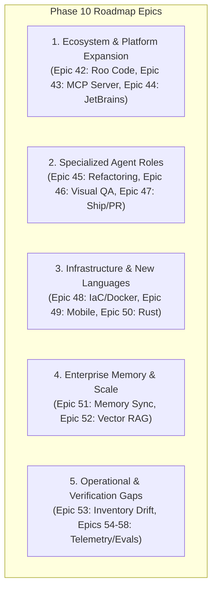

# Framework Gap Audit — 2026-07-25

Ad-hoc audit of current framework health, capability gaps, and roadmap priorities for the Context Engineering Framework (`ai-assistant-dot-files`) after reviewing repository structure, execution traces, and recent context-engineering guidance.

---

## 1. Executive Summary & Framework Health

* **Canonical Layer**: Single source of truth in [`shared/`](file:///Users/oscarrieken/Projects/Rieken/ai-assistant-dot-files/shared) across 36 agents, 65 skills, 9 rule suites, 12 contracts, memory registry, and project patterns.
* **Multi-Platform Capability Tiers**: Full Tier 1 support for Claude Code; Tier 2/1 hybrid for Cursor; Tier 2 for Windsurf and GitHub Copilot; Tier 3 for Gemini Antigravity and OpenAI Codex.
* **Automated Parity & CI Verification**: All 41 Epics across Phases 1–9 in [`TODO.md`](file:///Users/oscarrieken/Projects/Rieken/ai-assistant-dot-files/docs/features/context-engineering-framework/TODO.md) are complete. `scripts/ci-check.sh` passes 100% clean across parity diffing, agent prompt golden-file tests, structural health checks, and 6-platform install matrix validation.

---

## 2. Strategic Gap Analysis & Phase 10 Roadmap Epics

### Dimension 1: Next-Gen Platform & Tool Ecosystems
* **[Epic 42] Roo Code / Roo CLI / Cline Multi-Mode Integration**: Lacks dedicated configuration generators for custom sub-agent modes (`.roomodes` / `.clinerules`) and tool schemas.
* **[Epic 43] Standardized Model Context Protocol (MCP) Tool Packaging**: While `mcp-add` skill exists, the framework has no canonical `shared/mcp/` directory or generator to package framework skills into standalone MCP servers for Cursor MCP, Claude Desktop, or custom agent runtimes.
* **[Epic 44] JetBrains / Junie System Prompt Exporter**: Missing native system prompt exporter for JetBrains AI Assistant.

### Dimension 2: Specialized Agent Roles & Pipelines
* **[Epic 45] Automated Codemod & Refactoring Agent (`refactor-engineer`)**: `modernization-supervisor` (persona) and `refactor-to-pattern` (skill) exist, but there is no dedicated pipeline agent with an explicit contract for large-scale structural refactoring, framework migrations, or AST codemods.
* **[Epic 46] Visual QA & Screenshot Diffing Agent (`visual-qa-engineer`)**: Saturday framework patterns mention screenshot diffing & heatmaps (`Saturday.ML` / `saturday-ml`), but there is no `visual-qa-engineer` agent or automated visual diff testing pipeline in `shared/agents/`.
* **[Epic 47] Automated Release & PR Skill (`ship-feature`)**: Approval Gates #1 and #2 exist in `shared/rules/approval-gates.md`, but there is no automated skill that creates feature branches, formats commits, links specs/retrospectives, and opens GitHub PRs.

### Dimension 3: Infrastructure & Additional Language Guardrails
* **[Epic 48] Infrastructure-as-Code & Container Guardrails (`iac-conventions.md`)**: `devops-engineer` and `sre-engineer` agents exist, but `shared/rules/` lacks explicit guardrails for Terraform/OpenTofu, Dockerfile security linting, Helm, and GitHub Actions workflow hardening.
* **[Epic 49] Mobile Stack Conventions (`swift-conventions.md` & `kotlin-conventions.md`)**: `shared/rules/` lacks `swift-conventions.md` and `kotlin-conventions.md` detailing XCTest/Nimble or JUnit/Espresso testing taxonomies.
* **[Epic 50] Systems Programming Conventions (`rust-conventions.md`)**: Missing `rust-conventions.md` (`cargo`, `proptest`, `mockall`, `rstest`) for memory-safe systems programming.

### Dimension 4: Enterprise Memory & Distributed Scale
* **[Epic 51] Enterprise Memory Sync (`install.sh --sync-memory`)**: KIs reside locally in `shared/knowledge/` and `.claude/knowledge/`. There is no `./install.sh --sync-memory` command or Git submodule integration to sync organizational KIs to/from a central repository.
* **[Epic 52] Semantic Vector RAG (LightRAG Integration)**: Lexical regex matching in `search-ki` can miss semantic synonyms as the pattern catalog and KI corpus grow past 100+ files.

### Dimension 5: Operational & CI Verification Gaps
* **[Epic 53] Deterministic Inventory Drift Check**: Need a CI fitness function comparing `shared/agents/` and `shared/skills/` counts against `README.md`, `docs/AGENT_REFERENCE.md`, and generated configs.
* **[Epic 54] Telemetry & Runtime Event Loop Wiring**: Connect `event-recorder` and search telemetry to `retrieval-evaluator` & `agent-scorecard`.
* **[Epic 55] Agent Golden-File Eval Expansion**: Expand `tests/agents/` golden-file fixtures across all 36 agents.
* **[Epic 56] AOS Workflow Producer-Auditor Loop**: Wire Phase 3 producer → `validate-artifact` → counter-auditor → proceed/retry flow.
* **[Epic 57] Context-Manifest Test Coverage & Fixtures**: Add fixtures for `scripts/check-context-budget.sh`.
* **[Epic 58] Documentation Auditor Automation**: Integrate `documentation-auditor` into repeatable health-check workflows.

---

## 3. Actionable TODO Checklist

- [ ] **[Epic 53] Deterministic Inventory Drift Check** — Add a script/CI check that compares actual `shared/agents/` and `shared/skills/` inventories against `README.md`, `docs/AGENT_REFERENCE.md`, generated prompts, and changelog references.
- [ ] **[Epic 42] Roo Code / Cline Multi-Mode Integration** — Add Roo Code platform target generating `.roomodes` / `.clinerules`.
- [ ] **[Epic 43] Standardized MCP Tool Packaging** — Create canonical `shared/mcp/` exporter for Cursor/Claude Desktop MCP servers.
- [ ] **[Epic 44] JetBrains / Junie Prompt Exporter** — Add native prompt export for JetBrains AI Assistant.
- [ ] **[Epic 45] Automated Refactoring Agent (`refactor-engineer`)** — Build agent + contract for AST codemods and structural refactoring.
- [ ] **[Epic 46] Visual QA & Screenshot Diffing Agent (`visual-qa-engineer`)** — Build visual regression pipeline integrated with Saturday framework.
- [ ] **[Epic 47] Automated Release & PR Skill (`ship-feature`)** — Build skill to automate branch creation, commit formatting, PR description compilation, and release tagging.
- [ ] **[Epic 48] Infrastructure & IaC Conventions** — Create `shared/rules/iac-conventions.md` (Terraform, Docker, K8s, GitHub Actions).
- [ ] **[Epic 49] Mobile Stack Conventions** — Create `swift-conventions.md` and `kotlin-conventions.md`.
- [ ] **[Epic 50] Systems Programming Conventions** — Create `rust-conventions.md` (`cargo`, `proptest`, `mockall`).
- [ ] **[Epic 51] Enterprise Memory Sync** — Add `./install.sh --sync-memory` to pull/push Knowledge Items to/from an org-wide memory repo.
- [ ] **[Epic 52] Semantic Vector RAG** — Integrate LightRAG vector search backend for `search-ki` and `query-memory`.
- [ ] **[Epic 54] Telemetry & Runtime Event Loop Wiring** — Connect `event-recorder` and search telemetry to `retrieval-evaluator` & `agent-scorecard`.
- [ ] **[Epic 55] Agent Golden-File Eval Expansion** — Expand `tests/agents/` golden-file fixtures across all 36 agents.
- [ ] **[Epic 56] AOS Workflow Producer-Auditor Loop** — Wire Phase 3 producer → `validate-artifact` → counter-auditor → proceed/retry flow.
- [ ] **[Epic 57] Context-Manifest Test Coverage & Fixtures** — Add fixtures for `scripts/check-context-budget.sh`.
- [ ] **[Epic 58] Documentation Auditor Automation** — Integrate `documentation-auditor` into repeatable health-check workflows.

---

## 4. Priority Recommendation

1. **[Epic 53] Deterministic Inventory Drift Check** — High value, low-risk, and prevents agent/skill count drift in documentation.
2. **[Epic 42] Roo Code Multi-Mode Integration** — Expands Tier 2 multi-platform coverage to Roo Code / Cline users.
3. **[Epic 47] Automated Release & PR Skill (`ship-feature`)** — Closes the end-of-pipeline delivery automation gap.
