# Deliver-Feature Workflow (with Counter Agents)

Visual reference for the full `/deliver-feature` pipeline: producer agents, the artifacts they produce, the counter agents that audit each artifact, and the human approval gates.

## State this diagram represents

**Post-AOS-Phase-3 target state.** Some counter agents (context-auditor, documentation-auditor, privacy-auditor, etc.) do not exist yet in the current framework — they land in Phase 2 (see `docs/aos/prompts/phase-2-governance.md`). The audit-after-producer edges (dashed lines to counter agents) become the default composition once Phase 3 Op 3.13 ships. Today, only `validate-artifact`'s structural check runs at each handoff.

The diagram is deliberately drawn in this target shape so it can serve as the reference for both current work (which counters exist, which don't) and future work (which need to be built).

**Legend:**
- **Solid arrow** — pipeline flow, must complete before proceeding
- **Dashed arrow** — audit relationship, findings flow back to the producer for retry
- **Diamond** — validation checkpoint (structural via `validate-artifact`, or semantic via a counter agent)
- **Highlighted rectangle** — human PAUSE checkpoint per `shared/rules/approval-gates.md`
- **Italic label** — conditional agent (only runs when the feature's shape requires it)

## The pipeline

```mermaid
graph TB
    Start([User invokes /deliver-feature spec.md]):::input
    Spec[features/spec.md]:::artifact
    Start --> Spec

    %% Discovery
    Spec --> CE[context-engineer]:::producer
    CE --> CM[context-manifest.md]:::artifact
    CM --> VA1{validate-artifact}:::gate
    VA1 -.->|opt-in| CtxAud[context-auditor]:::counter
    CtxAud -.->|findings| CE
    VA1 -->|structural pass| ANA

    %% Analysis
    ANA[analyst]:::producer
    ANA --> AnaM[analysis.md]:::artifact
    AnaM --> VA2{validate-artifact}:::gate
    VA2 -->|structural pass| PAUSE1{{HUMAN: spec ready?}}:::human
    PAUSE1 -->|approved| ARCH

    ARCH[architect]:::producer
    ARCH --> ArchM[architecture-notes.md]:::artifact
    ArchM --> VA3{validate-artifact}:::gate
    VA3 -->|structural pass| CondBranch{Conditional branch}:::branch

    %% Conditional agents
    CondBranch -->|if perf-sensitive| PERF[<i>performance-engineer</i>]:::conditional
    CondBranch -->|if schema changes| DATA[<i>data-engineer</i>]:::conditional
    CondBranch -->|always| DEV
    PERF --> PerfM[performance-report.md]:::artifact
    DATA --> DataM[data-engineering-notes.md]:::artifact
    PerfM --> DEV
    DataM --> DEV

    %% Implementation
    DEV[developer]:::producer
    DEV --> ImplM[implementation-notes.md]:::artifact
    ImplM --> VA4{validate-artifact}:::gate
    VA4 -->|structural pass| CR

    CR[code-reviewer]:::counter_inline
    CR --> CRR[code-review-report.md]:::artifact
    CRR -->|CHANGES REQUESTED| DEV
    CRR -->|APPROVED| PAUSE2{{HUMAN: git commit?<br/>gate #2}}:::human
    PAUSE2 -->|approved| SR

    %% Review — parallel audits
    SR[security-reviewer]:::producer
    SR --> SecM[security-report.md]:::artifact
    SecM -.->|opposing-force pair| Priv[privacy-auditor]:::counter
    Priv -.->|findings| SR
    SR --> AE

    AE[<i>accessibility-engineer</i><br/>if UI]:::conditional
    AE --> AccM[accessibility-report.md]:::artifact
    AccM --> QA

    %% Verification
    QA[qa-engineer]:::producer
    QA --> QAM[qa-report.md]:::artifact
    QAM --> VQA

    VQA[<i>visual-qa-engineer</i><br/>if UI + heatmap/baselines]:::conditional
    VQA --> VQAM[visual-qa-report.md]:::artifact
    VQAM --> SRE

    SRE[sre-engineer]:::producer
    SRE --> ObsM[observability-report.md]:::artifact
    ObsM --> TW

    %% Documentation + Delivery
    TW[tech-writer]:::producer
    TW --> DocsM[docs-report.md]:::artifact
    DocsM -.->|opt-in| DocAud[documentation-auditor]:::counter
    DocAud -.->|findings| TW
    DocsM --> DE

    DE[devops-engineer]:::producer
    DE --> DevOpsM[devops-report.md]:::artifact
    DevOpsM --> Persist[Persist all artifacts to docs/features/&lt;name&gt;/]:::system
    Persist --> PAUSE3{{HUMAN: ship to Friday?<br/>gate #1}}:::human
    PAUSE3 -->|approved| Done([Delivered])

    %% Styling
    classDef producer fill:#dbeafe,stroke:#1e40af,color:#1e3a8a
    classDef counter fill:#fee2e2,stroke:#b91c1c,color:#7f1d1d,stroke-dasharray: 4 3
    classDef counter_inline fill:#fef3c7,stroke:#b45309,color:#78350f
    classDef conditional fill:#e0e7ff,stroke:#4338ca,color:#3730a3,stroke-dasharray: 6 3
    classDef artifact fill:#f3f4f6,stroke:#4b5563,color:#111827
    classDef gate fill:#d1fae5,stroke:#047857,color:#065f46
    classDef human fill:#fbcfe8,stroke:#be185d,color:#831843,stroke-width:2px
    classDef branch fill:#e5e7eb,stroke:#374151,color:#111827
    classDef input fill:#fff,stroke:#374151,color:#111827
    classDef system fill:#f5f5f4,stroke:#57534e,color:#292524
```

## Per-agent reference

| Agent | Artifact | Counter agent | Runs when | Notes |
|---|---|---|---|---|
| `context-engineer` | `context-manifest.md` | `context-auditor` (Phase 2) | Always | Prunes irrelevant files, surfaces KIs |
| `analyst` | `analysis.md` | — | Always | Domain modeling + AC + edge cases |
| `architect` | `architecture-notes.md` | (pattern-reviewer for ADRs it produces) | Always | Layer decisions + fitness functions |
| `performance-engineer` | `performance-report.md` | — | Perf-sensitive features | Shift-left perf review |
| `data-engineer` | `data-engineering-notes.md` | — | Schema changes | Expand/Contract migrations |
| `developer` | `implementation-notes.md` | `code-reviewer` (inline) | Always | Implements per plan |
| `code-reviewer` | `code-review-report.md` | — | Always (audits developer) | Can send back to developer |
| `security-reviewer` | `security-report.md` | `privacy-auditor` (Phase 2, paired) | Auth/data-crossing features | STRIDE threat modeling |
| `accessibility-engineer` | `accessibility-report.md` | — | UI features | Semantic HTML + ARIA + keyboard nav |
| `qa-engineer` | `qa-report.md` | — | Always | Writes tests, runs suite |
| `visual-qa-engineer` | `visual-qa-report.md` | `visual-qa-report-contract.md` | UI features with heatmap/baselines | Screenshot regression + heatmap cold-spot analysis |
| `sre-engineer` | `observability-report.md` | (retrieval-evaluator adjacent) | Always | OTel + SLIs + log cardinality |
| `tech-writer` | `docs-report.md` | `documentation-auditor` (Phase 2) | Always | README + ADRs + inline docs |
| `devops-engineer` | `devops-report.md` | — | Always | CI/CD + env config + deploy steps |

## Counter agents not shown in this diagram

Not every counter agent from the AOS Phase 2 producer/counter pairs (see `docs/aos/AOS_Governance_Design_Pack/01-Governance-Checks-and-Balances.md`) participates in `/deliver-feature`. Some audit meta-framework concerns rather than pipeline artifacts:

- `memory-auditor` — audits KIs in `shared/knowledge/` (post-delivery, on `/promote-memory` runs)
- `knowledge-auditor` — audits KI schema compliance (invoked by `/create-ki`)
- `prompt-evaluator`, `agent-evaluator`, `rule-auditor`, `pattern-reviewer`, `tool-validator` — audit framework-authored artifacts (agents, skills, rules, patterns, tools), not pipeline artifacts. Run during framework maintenance, not per feature.
- `retrieval-evaluator` — audits KI + ADR corpus retrievability (informed by telemetry from search_ki / search_ki_semantic invocations).

And the 4 opposing-force pairs from Phase 2 are framework-wide, not pipeline-scoped:
- Memory Expansion ↔ Memory Compression
- Learning Engine ↔ Forgetting Engine
- Cost Optimizer ↔ Quality Optimizer
- Orchestrator (`/deliver-feature` itself) ↔ Scheduler (cron/hook-driven runs)

## The audit-after-producer pattern

Post-AOS Phase 3 Op 3.13, every dashed-arrow "counter agent" in the diagram becomes the default composition — each producer step is followed automatically by:

1. `validate-artifact` — structural check against `shared/contracts/`
2. Counter agent invocation (if one exists for this producer's artifact) — semantic check
3. On any counter finding a critical issue, the artifact is sent back to the producer with the specific findings for a retry

A per-project config knob can disable the counter step (falling back to structural-only), but the default is "audits run." This is what makes the diagram's dashed arrows load-bearing rather than aspirational.

## Human approval gates

Three PAUSE points shown in the diagram, each backed by `shared/rules/approval-gates.md`:

- After analysis (spec-ready gate): human confirms the analyst's read of the spec before architect commits to structural decisions
- After code-reviewer approval (gate #2): human approves before `git commit`
- Before Friday ship (gate #1): human approves the delivery summary post

Additional gates from `approval-gates.md` fire only when their trigger conditions arise (migrations, external API mutations, deploys, etc.) — those aren't in every pipeline run and so aren't drawn on the main flow.

## Related docs

- `shared/skills/deliver-feature/SKILL.md` — the current skill implementation
- `shared/rules/approval-gates.md` — the 8 non-negotiable gates
- `docs/aos/AOS_Governance_Design_Pack/01-Governance-Checks-and-Balances.md` — full 15 producer/counter pairs
- `docs/aos/prompts/phase-2-governance.md` — handoff for building the counter agents
- `docs/aos/prompts/phase-3-runtime.md` § Op 3.13 — handoff for making audit-after-producer the default composition
- `docs/prompts/automate-deliver-feature.md` — design handoff for policy-driven gate automation
