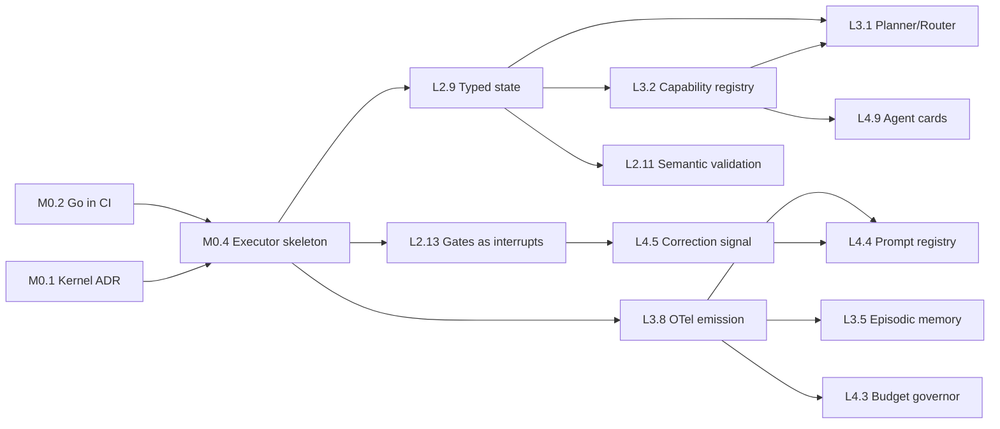

# `loom` Build Roadmap — L2 → L4

**Status**: active build plan · **Framework version**: v3.3.14 @ `59efe14` · **Compiled**: 2026-08-29
· **Status markers last reconciled**: 2026-08-31

> **Reading the Problem statements.** Each item's "Problem" paragraph describes the state of the
> repository *when this roadmap was compiled*, in present tense. Items that have since shipped carry
> a **SHIPPED** line under their workstream header — read that first, because the Problem paragraph
> below it is deliberately preserved as the historical motivation, not as a current claim.
>
> Absence of a SHIPPED line means only that no one has reconciled it, not that the work is unbuilt.
> Markers below were verified against the code on the date above; older milestones (M0.1–M0.3, L2.4,
> D.1–D.5) shipped earlier and are tracked in `docs/prompts/README.md`'s Completed Prompts table.

This is the single authoritative roadmap. It merges and supersedes:

| Source | Items | Disposition |
|---|---|---|
| [`agy.md`](agy.md) | 9 | Fully absorbed. Two items contributed material this plan did not have (host-IDE execution dependency; context-isolated reflexion). Two path citations corrected — see Appendix B. |
| [`maturity-todo-2026-08-29.md`](maturity-todo-2026-08-29.md) | 41 | Fully absorbed, re-sequenced into milestones with dependencies and acceptance criteria. |
| [`architectural-audit-2026-08-29.md`](architectural-audit-2026-08-29.md) | H1–H11 | Retained as the evidence document. Not superseded — read it for the *why*; read this for the *what next*. |

**45 items across 5 milestones**, plus the appended **PLATFORM — Distribution & Adoption**
workstream (D.1–D.5, appended 2026-08-29 from the distribution-strategy discussion — see
`docs/prompts/epic-75-distribution-adoption.md` for the executable handoff prompts). Every path
cited was verified to resolve on 2026-08-29.

---

## How to use this document

Each item carries six fields:

| Field | Meaning |
|---|---|
| **ID** | Stable reference (`M0.1`, `L2.4`, …). Never renumber — append instead. |
| **Workstream** | Which parallel track this belongs to. Items in different workstreams can proceed concurrently. |
| **Effort** | S = under a day · M = a few days · L = a week or two · XL = a month+ |
| **Blocked by / Blocks** | Hard dependency edges. Respect these; the sequencing is not advisory. |
| **Problem / Fix / Target Files** | As in the source documents. |
| **Done when** | A falsifiable acceptance criterion. If you cannot demonstrate it, the item is not done. |

Workstreams:

- **KERNEL** — the executor process: state, checkpoints, gates, retries, budget
- **TOOLS** — the MCP tool runtime: registry, validation, resilience, transport
- **MEMORY** — retrieval, episodic store, KI lifecycle
- **OBSERVE** — telemetry, evaluation, CI
- **PLATFORM** — provider abstraction, interop, distribution

---

## Critical path

**If only three things get built**: `L2.9` (typed state), `M0.4`+`L2.13` (executor owning gates and
retries), and `L3.8` (OTel emission). Those unblock roughly two-thirds of everything else.

---

# MILESTONE 0 — Foundations

Nothing else is safely buildable until these land. M0.2 in particular is one day of work and is the
highest-leverage item in the entire document.

### M0.1 — Decide and record what `loom` is
**Workstream**: KERNEL · **Effort**: S · **Blocked by**: none · **Blocks**: M0.4

1. **Problem**: The repository is 52k lines of markdown specification and 8.9k lines of Go that only
   installs files. `README.md` and `docs/ARCHITECTURE.md` describe orchestration, telemetry, policy
   evaluation, and retrieval tiers as though implemented; all are prose with no executor. The
   ambiguity is load-bearing — it is why 20 items below target an `internal/orchestrator/` that does
   not exist, and why `agy.md` and `maturity-todo` both independently proposed "build a kernel"
   without either committing to it.
2. **Architectural Fix**: Write ADR-00N answering one question: does `loom` **execute** pipelines, or
   does it **validate and distribute** content a host runtime executes? Both are defensible products.
   Every item in M0.4 onward assumes the first. If the answer is the second, delete Milestones 1–4
   and reduce this to a content-quality roadmap — that is a legitimate outcome, but it must be chosen
   rather than drifted into.
3. **Target Files**: new `docs/adrs/`, `README.md`, `docs/ARCHITECTURE.md`
4. **Done when**: an accepted ADR exists and `README.md` no longer describes unimplemented subsystems
   in the present tense.

### M0.2 — Put the Go in CI and turn the framework's rules on itself
**Workstream**: OBSERVE · **Effort**: S · **Blocked by**: none · **Blocks**: M0.4 · *(audit H9)*

1. **Problem**: `.github/workflows/framework-ci.yml` runs five bash/python scripts and **zero Go
   steps** — no `go build`, `go test`, `go vet`, `golangci-lint`. There is no `.golangci.yml`.
   `shared/mcp/` has **0.0% coverage in every package** against the non-negotiable 85% rule. The
   workflow has **no `permissions:` block** and pins `actions/checkout@v4` (mutable tag) across all
   six jobs — both violations of `iac-conventions.md`, which `loom-release.yml` gets right. And
   `scripts/test-agents.sh` reports "20 passed, 0 failed, 32 skipped" from **one** `actual-output.md`
   across 33 fixture dirs, because SKIP exits 0 by design.
2. **Architectural Fix**: Add build/test/vet/lint jobs for both modules. Write the `.golangci.yml`
   the framework mandates elsewhere, with `gocyclo` capped at 6. Add a coverage ratchet starting at
   today's real number. Add `permissions:` and SHA-pin every action. Make the agent suite fail on
   missing fixtures rather than passing. Then run the framework's own `verify_dependencies` and
   `analyze_complexity` against this repo — the first *will* fail on M0.3's finding, which is the
   point.
3. **Target Files**: `.github/workflows/framework-ci.yml`, new `.golangci.yml`,
   `scripts/test-agents.sh`, `scripts/ci-check.sh`, `Makefile`
4. **Done when**: CI fails on a deliberately introduced compile error, a deliberately introduced
   complexity-9 function, and a deliberately deleted test fixture.

### M0.3 — Fix the domain-layer dependency violation
**Workstream**: TOOLS · **Effort**: S · **Blocked by**: M0.2 · **Blocks**: L2.1 · *(audit H4)*

1. **Problem**: `shared/mcp/internal/domain/tool.go` — commented as "the framework's first-class
   abstraction for every capability" — imports `github.com/mark3labs/mcp-go/mcp` and
   `invopop/jsonschema`, and types its own signatures in them (`mcp.ToolInputSchema`,
   `mcp.CallToolRequest`, `*mcp.CallToolResult`). That is `architecture-guardrails.md` #1 violated in
   the one file defining the tool abstraction, in the framework that sells verifiable architecture.
2. **Architectural Fix**: Hexagonal port/adapter. Define transport-free
   `ToolRequest{Name string; Args map[string]any}` and
   `ToolResult{Content []ContentBlock; IsError bool; Err error}` in `domain`; move all `mcp.*`
   marshalling into a new `server/mcp_adapter.go`. `domain` imports zero third-party packages.
3. **Target Files**: `shared/mcp/internal/domain/tool.go`,
   `shared/mcp/internal/server/registration.go`, all 6 `shared/mcp/internal/tools/*_tool.go`
4. **Done when**: `go list -deps ./internal/domain` shows only stdlib, and the CI fitness function
   from M0.2 enforces it.

### M0.4 — Stand up the executor skeleton
**Workstream**: KERNEL · **Effort**: L · **Blocked by**: M0.1, M0.2 · **Blocks**: L2.9, L2.12, L2.13, L2.14, L3.1, L3.3, L3.8, L4.1

**SHIPPED** 2026-08-29 (epic 76, `ba78f21` + `cab0156`) — `internal/orchestrator/` owns the run
loop and durable `run-state.json`; `loom run` executes the built-in plan via a claude subprocess
provider, with a mock provider for tests.

1. **Problem**: Both source roadmaps assume a kernel and neither builds one. `agy.md` item 1 names it
   ("a native tool orchestration kernel"); the maturity TODO targets `internal/orchestrator/*` in
   nine separate items. It does not exist. Today `loom` has **no execution engine at all** — it
   generates prompt configurations and relies entirely on host platforms (Claude Code, Cursor,
   Windsurf) to run agents, which ties framework resilience, retry semantics, and gate enforcement to
   proprietary IDE behavior the framework cannot observe or control.
2. **Architectural Fix**: A minimal Go executor that owns the run loop: load a plan, execute stages
   in order, persist state, invoke an agent via a provider adapter, and stop. No routing, no
   parallelism, no policy — those are later items that plug into it. Ship it running the existing
   linear `deliver-feature` sequence as a hardcoded default plan, so behavior is preserved while the
   substrate changes underneath.
3. **Target Files**: new `internal/orchestrator/` (executor, stage, plan), new `internal/provider/`,
   `cmd/loom/cmd/` (new `run` subcommand)
4. **Done when**: `loom run --spec features/<x>.md` executes at least three real stages end-to-end,
   writes state, and resumes correctly after `SIGINT`.

### M0.5 — Delete or compile `shared/mcp-patterns/go/`
**Workstream**: TOOLS · **Effort**: S · **Blocked by**: none · **Blocks**: none · *(audit H10)*

1. **Problem**: ~1,200 lines of `//go:build ignore` copies of `shared/mcp/internal/`, in no Go
   module, referenced by no build, presented as the reference implementation teams should copy. All
   11 shared files have diverged from their originals (`retriever.go` by 186 diff lines,
   `bm25_retriever.go` by 106). It ships bugs downstream — including the concurrency defect its own
   comment documents at line 40 — and can never be compiled, tested, or kept honest.
2. **Architectural Fix**: Delete it. If a reference implementation is genuinely wanted, make it a
   compiled example module in the workspace with its own tests, so drift becomes a build failure.
   Copy-paste distribution of a Go library is the wrong mechanism when `register.FrameworkTools`
   already exists as a supported embedding path.
3. **Target Files**: `shared/mcp-patterns/go/**` (delete), `shared/mcp-patterns/README.md`,
   `shared/mcp/register/register.go`
4. **Done when**: no `//go:build ignore` file remains in the repo and `README.md` documents
   `register.FrameworkTools` as the supported integration path.

---

# MILESTONE 1 — Level 2: Coordinated Multi-Agent Systems

*Agents are task-specific, use tools reliably, and coordinate in deterministic workflows with
human-in-the-loop control.*

## Workstream: TOOLS — Tool Execution & Validation

### L2.1 — Enforce input schemas server-side instead of trusting the model
**Workstream**: TOOLS · **Effort**: M · **Blocked by**: M0.3 · **Blocks**: L2.5

1. **Problem**: `InputSchema()` exists only to describe arguments *to the LLM*. Enforcement is
   unchecked type assertion — `parseComplexityArgs` does `args["projectPath"].(string)` and silently
   yields `""` on any non-string, then returns a generic error. A hallucinated argument shape
   produces a soft failure the model re-attempts blindly. No required-field check, no enum check, no
   bounds.
2. **Architectural Fix**: Validate every `Args` map against the tool's declared JSON Schema at the
   handler boundary *before* dispatch, returning a structured `ValidationError` naming the offending
   field and expected type — a machine-actionable repair signal, not prose.
   `github.com/santhosh-tekuri/jsonschema/v6` is **already in the dependency graph** as an indirect
   dep of `mcp-go`; promote it to direct.
3. **Target Files**: `shared/mcp/internal/server/registration.go`,
   `shared/mcp/internal/tools/schemas.go`, `shared/mcp/go.mod`
4. **Done when**: a malformed-argument call returns a field-level validation error, and a test
   asserts it for all six tools.

### L2.2 — Propagate `context.Context` and set per-tool deadlines
**Workstream**: TOOLS · **Effort**: M · **Blocked by**: M0.3 · **Blocks**: L2.5

1. **Problem**: All six tools sign `Execute(_ context.Context, ...)` —
   `analyze_complexity_tool.go:54`, `check_accessibility_tool.go:52`,
   `check_ubiquitous_language_tool.go:50`, `search_docs_tool.go:64`, `search_ki_tool.go:56`,
   `verify_dependencies_tool.go:40`. Cancellation is discarded 100% of the time. A client
   disconnect, timeout, or user abort cannot stop an in-flight `filepath.Walk`.
   `go-conventions.md` mandates explicit timeouts; the tool layer has none.
2. **Architectural Fix**: Thread `ctx` through `Execute` → analyzer → walk, checking `ctx.Err()`
   inside every `filepath.WalkDir` callback. Add registration middleware applying
   `context.WithTimeout` from a per-tool budget in the registry entry.
3. **Target Files**: all 6 `shared/mcp/internal/tools/*_tool.go`,
   `shared/mcp/internal/analyzers/*.go`, `shared/mcp/internal/server/registration.go`
4. **Done when**: a cancelled context aborts an in-progress walk within 100ms, proven by test.

### L2.3 — Confine filesystem access to an explicit root
**Workstream**: TOOLS · **Effort**: M · **Blocked by**: M0.3 · **Blocks**: none

1. **Problem**: `analyze_complexity` accepts an arbitrary `projectPath` from model-controlled
   arguments with no validation, no root confinement, and no symlink handling, then walks it
   unbounded and uncancellably. `projectPath: "/"` walks the disk. Same pattern in
   `check_accessibility`, `check_ubiquitous_language`, `verify_dependencies`, and `search_docs`
   (`docsPath`).
2. **Architectural Fix**: Adopt `os.Root` (available on `go 1.26.5`) for traversal-safe rooted FS
   access, with the root supplied by server config rather than tool arguments. Reject paths that
   escape it. Add a file-count and byte ceiling to abort runaway walks.
3. **Target Files**: `shared/mcp/internal/analyzers/walkutil.go`,
   `shared/mcp/internal/analyzers/*_analyzer.go`, `shared/mcp/internal/server/tool_provider.go`
4. **Done when**: `projectPath: "/"` and `projectPath: "../../etc"` are both rejected, with tests.

### L2.4 — Replace the hardcoded tool slice with a registry
**Workstream**: TOOLS · **Effort**: M · **Blocked by**: M0.3 · **Blocks**: L2.2, L2.5, L3.2, L4.7

1. **Problem**: `buildFrameworkTools()` is a slice literal returning six constructor calls. Adding a
   tool means editing and recompiling the handler. No discovery, no per-tool metadata (timeout,
   retry policy, permission scope, version), no enable/disable, and no way for a downstream project
   to contribute a tool without forking.
2. **Architectural Fix**: `map[string]ToolRegistration` where the registration carries the `Tool`,
   its timeout, retry class, and required permission scope. Populate via per-file `Register(name,
   reg)` or an explicit registry-builder consuming config. `register.FrameworkTools` becomes a
   registry merge rather than wholesale re-registration.
3. **Target Files**: `shared/mcp/internal/server/tool_provider.go`,
   `shared/mcp/internal/server/handler.go`, `shared/mcp/register/register.go`
4. **Done when**: a new tool is added by one `Register` call with no edit to `handler.go`.

### L2.5 — Introduce a typed failure taxonomy
**Workstream**: TOOLS · **Effort**: M · **Blocked by**: L2.1, L2.2, L2.4 · **Blocks**: L2.6, L4.2

1. **Problem**: Every failure path collapses to `mcp.NewToolResultError(fmt.Sprintf(...))` with
   `err == nil` — a *successful* tool call carrying a prose error string. The caller cannot
   distinguish "bad argument, fix and retry" from "corpus missing, stop" from "transient I/O, back
   off." `search_docs` goes further, returning `Success: true, TotalHits: 0` with the failure reason
   smuggled into the `Query` field (`emptyResult`, line 101) — indistinguishable from a genuine
   zero-result search.
2. **Architectural Fix**:
   `ToolError{Kind: Validation|NotFound|Transient|Internal|Permission, Field, Message, Retryable bool}`
   serialized into a stable `error` envelope. Never encode failure state into a success payload.
   Orchestrator retry policy keys off `Kind`.
3. **Target Files**: `shared/mcp/internal/tools/responses.go`,
   `shared/mcp/internal/tools/search_docs_tool.go:101`, all `*_tool.go` error branches
4. **Done when**: no tool returns `Success: true` on a failure path, enforced by test.

### L2.6 — Add the resilience primitives the guardrails already mandate
**Workstream**: TOOLS · **Effort**: M · **Blocked by**: L2.5 · **Blocks**: L4.7

1. **Problem**: `architecture-guardrails.md` #5 forbids hand-rolled retry loops and requires
   `CircuitBreaker` or `ExponentialBackoffStrategy`. Neither exists anywhere in the Go tree. The only
   retry logic in the framework is prose in `deliver-feature/SKILL.md` telling an LLM to count to
   three.
2. **Architectural Fix**: `sony/gobreaker` per tool and per downstream dependency, plus
   `cenkalti/backoff/v4` for `Transient`-classed failures, wired as registry middleware so no tool
   implements its own retry. Emit breaker state transitions as telemetry.
3. **Target Files**: new `shared/mcp/internal/server/middleware.go`,
   `shared/mcp/internal/server/registration.go`, `shared/mcp/go.mod`
4. **Done when**: a tool failing 5× consecutively opens its breaker and returns immediately, proven
   by test.

### L2.7 — Fix the per-query full-corpus re-index
**Workstream**: TOOLS · **Effort**: M · **Blocked by**: L2.2 · **Blocks**: L3.7 · *(audit H2)*

1. **Problem**: `search_docs_tool.go:82` calls `EnsureIndex` inside `Execute`.
   `bm25_retriever.go:70` then walks the whole docs tree, `os.ReadFile`s every `.md`, and runs **one
   sqlite transaction per file** — no mtime check, no content hash, no dirty tracking. Every search
   is O(corpus) disk I/O plus O(n) transactions. `shared/mcp-patterns/go/tools/bm25_retriever.go:40`
   documents the rest: "EnsureIndex is not safe to call concurrently with itself" — and MCP servers
   field concurrent calls. Deleted docs are never evicted; `DELETE` only fires for re-inserted paths.
2. **Architectural Fix**: Move indexing out of the query path. Incremental index keyed on
   `(path, mtime, size)` or content hash in one batched transaction; a separate explicit
   `reindex_docs` tool plus optional `fsnotify` watcher; `sync.RWMutex` around writer access; a
   reconciliation sweep deleting rows whose paths no longer exist.
3. **Target Files**: `shared/mcp/internal/tools/bm25_retriever.go`,
   `shared/mcp/internal/tools/search_docs_tool.go`
4. **Done when**: a second identical query performs zero file reads, and a deleted doc disappears
   from results.

### L2.8 — Ship MCP over an authenticated network transport
**Workstream**: TOOLS · **Effort**: L · **Blocked by**: L2.4 · **Blocks**: L4.8

1. **Problem**: `cmd/mcp-server/main.go` calls `server.ServeStdio(s)` — stdio only. No streamable
   HTTP, no SSE, no authentication, no authorization, no tenancy, no per-caller rate limiting. The
   server is single-user, local-only, and has no notion of *who* is calling.
2. **Architectural Fix**: Streamable HTTP transport alongside stdio, with OAuth2/OIDC bearer
   validation, per-principal tool scoping enforced against the registry's permission field, and
   per-principal rate limits. Keep stdio for local dev.
3. **Target Files**: `shared/mcp/cmd/mcp-server/main.go`, `shared/mcp/internal/server/handler.go`,
   new `shared/mcp/internal/server/auth.go`
4. **Done when**: an unauthenticated HTTP call is rejected and a scoped token can reach only its
   permitted tools.

## Workstream: KERNEL — State Management

### L2.9 — Replace markdown-file state passing with a typed graph state
**Workstream**: KERNEL · **Effort**: XL · **Blocked by**: M0.4 · **Blocks**: L2.10, L2.11, L3.1, L3.2, L4.4

**SHIPPED (first cut)** 2026-08-31 (epic 79, `74155f1`…`3430594`) — `internal/state/` types the
analyst → architect hop: Go structs, JSON Schema generated into `shared/schemas/pipeline/`,
field-level projections, and markdown rendered as a view.

**SHIPPED (second cut)** 2026-09-01 (epic 83, `0b2d6c4`…) — the implementation chain:
`implementation-notes`, `security-report`, and `qa-report` are typed, joining `analysis`,
`architecture`, `route` (L3.0) and `review` (L2.17) for **seven typed artifacts**. Two contract
content rules became load-time invariants rather than greps — a non-zero `failed` test count and a
CRITICAL/HIGH security finding with no fix applied are now validation errors. `Stage.Consumes` became
plural and projections are keyed by `(consumer stage, upstream kind)`, since what a stage reads and
what it writes vary independently. **Eight of the fifteen artifacts still pass markdown** — the
end-of-pipeline reports (docs, devops, observability, accessibility, visual QA) and
`context-manifest`. Nothing evaluates a condition over those yet, which is why they were left.

1. **Problem**: There is no state object. Agents hand each other whole markdown documents on disk
   (`analysis.md`, `architecture-notes.md`, `implementation-notes.md`, … 15 artifacts). The only real
   delivery in the repo has a 15 KB `analysis.md`. Every downstream agent re-parses the full text;
   there is no field-level access, no size ceiling, no provenance, and no way to pass a value without
   passing a document.
2. **Architectural Fix**: A versioned `PipelineState` struct with per-stage typed sub-schemas (Go
   structs plus generated JSON Schema, or CUE as single source of truth). Markdown becomes a
   *rendered view* of state, not the transport. Agents receive a narrowly-scoped projection of the
   fields their contract declares, never the whole graph. `agy.md` proposed LangGraph or a custom
   FSM; a custom FSM is the right call here since the executor is Go and LangGraph would reintroduce
   a Python runtime dependency.
3. **Target Files**: `shared/orchestration/pipeline-schema.md` → generated; all 18
   `shared/contracts/*.md` → schemas; `shared/skills/deliver-feature/SKILL.md`; new `internal/state/`
4. **Done when**: two consecutive stages exchange data with no markdown file on the path, and a
   schema violation is a load-time error.

### L2.10 — Stop using an LLM as the context-compaction mechanism
**Workstream**: KERNEL · **Effort**: S (was M) · **Blocked by**: L2.9 · **Blocks**: none

**PARTLY ABSORBED** by epic 83 (2026-09-01). The two inter-stage call sites that existed were
replaced with deterministic projections of `AnalysisState`: `qa-engineer` (step 2) now receives
acceptance criteria, edge cases, QA tasks and the definition of done; `tech-writer` (step 1) receives
the summary, out-of-scope list and its own task list. Both agent files were edited and versioned.
Under `loom run` **no LLM call sits between the analysis and either agent**.

**What remains**:
1. The step 37a `--persist` retrieval surrogate in `deliver-feature/SKILL.md`, which is a *different*
   problem — the surrogate feeds `memory-registry`'s retrieval tier and has consumers of its own, so
   "replace it with field selection" is not the right fix and this item's done-when does not cover it.
   Deciding what the surrogate becomes is the open question here.
2. The markdown pipeline's fallback paths. Each edited agent keeps a no-executor path that reads the
   two relevant sections rather than the whole file — smaller context, but still a read the executor
   does by field selection. This closes only when those agents run under the executor.
3. Any call site introduced by typing the remaining eight artifacts.

1. **Problem**: Context decay is handled by `summarize-artifact --persist`, invoked at
   `deliver-feature/SKILL.md` step 37a — another LLM call producing a lossy ~200-word surrogate then
   indexed as a retrieval target. Compaction is nondeterministic, unverifiable, costs a model call,
   and silently drops whatever the summarizer deemed unimportant.
2. **Architectural Fix**: Deterministic projections. Each contract declares which fields downstream
   stages may read; the executor computes the projection by field selection, not summarization.
   Reserve LLM summarization for human-facing prose only, never machine handoff.
3. **Target Files**: `shared/skills/summarize-artifact/SKILL.md`,
   `shared/skills/deliver-feature/SKILL.md:139`, `shared/contracts/*.md`
4. **Done when**: no LLM call sits on the inter-stage data path.

### L2.11 — Make `validate-artifact` verify semantics, not heading presence
**Workstream**: KERNEL · **Effort**: M · **Blocked by**: L2.9 · **Blocks**: none

1. **Problem**: Contract validation checks that required `##` sections exist.
   `agent-scorecard/SKILL.md:29` confirms the depth: the analyst's "completeness score" is "fraction
   of required sections present **and** containing real content (not leftover `[...]` template
   placeholders)." That is a template-placeholder grep. A structurally perfect, semantically empty
   artifact passes every gate in the pipeline.
2. **Architectural Fix**: With typed state, validation becomes JSON Schema conformance plus
   declarative business rules — required cardinality, cross-field consistency, referential integrity
   against prior stages. Keep an LLM critic as an *additional* qualitative gate, never the structural
   one.
3. **Target Files**: `shared/skills/validate-artifact/SKILL.md`, `shared/contracts/*.md`,
   `shared/schemas/`
4. **Done when**: an artifact with all headings present but contradictory field values fails
   validation.

### L2.12 — Move `pipeline-state.json` ownership into the executor
**Workstream**: KERNEL · **Effort**: M · **Blocked by**: M0.4 · **Blocks**: L2.14

**SHIPPED** 2026-08-31 (epic 78, `8441ffc`…`7e574c9`) — digests are computed and re-verified in
Go, an edited artifact demotes its stage and cascades, and `loom state record/verify/approve/show/
timeline` gives the markdown pipeline a way to record checkpoints without hashing its own work.
`run-events.jsonl` gives events and timing an owner.

1. **Problem**: The state file — including SHA-256 checksums used for tamper detection and gate-edit
   detection — is written *by the LLM following prose instructions* (`deliver-feature/SKILL.md`,
   "Checkpointing & Pipeline State"). A model computing and recording its own integrity hashes is not
   integrity. No `pipeline-state.json` exists anywhere in the repo, so this has never executed.
2. **Architectural Fix**: The executor owns the file: atomic write (temp + `os.Rename`), a schema
   version field, real `sha256` computed in Go, verification on resume in code rather than by
   instruction. Agents never write it.
3. **Target Files**: `shared/skills/deliver-feature/SKILL.md`,
   `shared/skills/resume-pipeline/SKILL.md`, new `internal/orchestrator/checkpoint.go`
4. **Done when**: hand-editing an artifact causes the executor to detect the mismatch and refuse to
   treat that stage as complete.

## Workstream: KERNEL — Human-in-the-Loop

### L2.13 — Implement gates as process interrupts, not prose
**Workstream**: KERNEL · **Effort**: L · **Blocked by**: M0.4 · **Blocks**: L2.14, L4.5

**SHIPPED** 2026-08-30 (epic 77, `868c281`…`a971b2f`) — the executor refuses to start a gated
stage without a recorded human approval; approval arrives only via a TTY prompt or
`loom run --resume --approve <gate>`, and a halted run exits 3. Provider output cannot self-approve.
**Scope**: `loom run` only — the markdown pipeline and the other prose gates remain
prompt-discipline.

1. **Problem**: All eight gates in `approval-gates.md` are natural-language instructions ("user must
   say 'ship'"). The enforcement mechanism for an irreversible action — DB contract-phase `DROP`,
   deploy, external API mutation — is the model's willingness to comply with a paragraph. There is no
   code path that can physically prevent the action, and an LLM can hallucinate straight past a
   prompt-level guard.
2. **Architectural Fix**: The executor halts the process at gate boundaries, persists state, and
   yields to a real approval channel (CLI prompt, webhook, or queue). High-risk tool classes are
   declared in the tool registry and are *unreachable* without a signed approval token in the
   request. Enforcement lives below the model, not in it.
3. **Target Files**: `shared/rules/approval-gates.md`,
   `shared/skills/deliver-feature/SKILL.md:130-133`, new `internal/orchestrator/gate.go`, registry
   entries
4. **Done when**: an agent instructed to "skip the gate and deploy" cannot reach the deploy tool.

### L2.14 — Enforce "any edit resets the gate" in code
**Workstream**: KERNEL · **Effort**: M · **Blocked by**: L2.12, L2.13 · **Blocks**: L4.5

**SHIPPED** 2026-08-31 (epic 80, `27ac1f0`…`9db60ee`) — an approval binds to the digests of every
stage completed when it was given; an edit invalidates it, the run halts at that gate again, and the
invalidated record is kept for audit. Detection at verification rather than at the barrier, since a
re-run would otherwise overwrite the edit that caused it. `loom state verify` reports the same for
markdown-pipeline runs — detection, not enforcement.

1. **Problem**: Every gate in `approval-gates.md` declares "Reset condition: any edit to the pending
   artifact resets the gate." Nothing enforces it. The `gate_decision` telemetry spec describes
   checksum-diffing to detect `edited_then_approved` — but the checksum is computed by the model, the
   event is emitted by nobody, and no `events.jsonl` exists in the repository.
2. **Architectural Fix**: Approval binds to an artifact digest. The executor computes the digest at
   halt, issues a scoped approval token over it, and re-verifies at execution. Digest mismatch
   invalidates the token — a code-level check, not a remembered rule.
3. **Target Files**: `shared/rules/approval-gates.md`, `shared/telemetry/event-schema.md:112`,
   `internal/orchestrator/gate.go`
4. **Done when**: editing an artifact between approval and execution causes the execution to be
   refused.

### L2.15 — Make resume a real capability
**Workstream**: KERNEL · **Effort**: M · **Blocked by**: L2.12 · **Blocks**: none

1. **Problem**: `resume-pipeline/SKILL.md` implements three modes (resume, `--from-phase N`, per-agent
   rollback) entirely as instructions to an LLM to read state, recompute checksums, mark entries
   `"stale": true`, and jump to a numbered step in *another skill's* prose. There is no process to
   resume — the "pause" was only ever the model stopping. Steps are addressed by position in a
   hand-numbered 43-step list, so renumbering silently breaks every resume path.
2. **Architectural Fix**: Durable executor with content-addressed stage IDs (never ordinals), a real
   checkpoint store, and resume as a first-class operation replaying from persisted state. Rollback
   becomes state-graph surgery in code, not markdown restoration by instruction.
3. **Target Files**: `shared/skills/resume-pipeline/SKILL.md`,
   `shared/skills/deliver-feature/SKILL.md`, `shared/orchestration/interface.md`
4. **Done when**: `kill -9` mid-stage followed by `loom run --resume` continues from the last
   checkpoint with no duplicated work.

### L2.16 — Replace the LLM policy evaluator with a real one
**Workstream**: KERNEL · **Effort**: M · **Blocked by**: L2.13 · **Blocks**: L4.3 · *(audit H7)*

1. **Problem**: `policy-evaluator.md` specifies a condition language
   (`filePaths.noneMatch: "**/security/**"`, `diffLines.lessThan`, `not:`, `any:`) whose evaluator is
   a prompt. An authorization decision — *may this pipeline commit without a human* — is resolved by
   natural-language reasoning over YAML, with the kill-switch, the always-human list, and the
   conflict-resolution table all in the same prose the model may misread. `policy-schema.md`'s own
   worked example has a duplicate `diffType:` key in one map, which is invalid YAML — no parser has
   ever seen it.
2. **Architectural Fix**: `google/cel-go` or OPA/Rego. The condition schema maps near-directly onto
   CEL. The always-human gate list becomes a compiled constant. Add a policy unit-test harness and
   make `--dry-run-policies` actually execute.
3. **Target Files**: `shared/orchestration/policy-evaluator.md`, `shared/policies/policy-schema.md`,
   `shared/policies/examples/*.policy.yaml`, new `internal/policy/`
4. **Done when**: a policy targeting an always-human gate is rejected at load time, and the invalid
   YAML example above fails to parse.

---

## Workstream: PLATFORM — Distribution & Adoption

*Appended 2026-08-29. Strategy: MCP becomes the portable capability surface (executable behavior on
every MCP-speaking host); the dotfile/markdown export becomes the Level 1 convenience layer. loom
ships both a standalone server (`loom mcp serve`) and a semver'd embedding package, from one module.
The maturity ladder (L1→L4) becomes a first-class install concept rather than a roadmap-only idea.
These items constitute loom's **public API** — several are adoptable by external teams before the
orchestration kernel exists, which is why they sit in Milestone 1 despite spanning levels.*

### D.1 — Fold the MCP server into the `loom` binary as `loom mcp serve`
**Workstream**: PLATFORM · **Effort**: M · **Blocked by**: none · **Blocks**: D.3, D.5

1. **Problem**: The MCP server is a separate module with its own entrypoint
   (`shared/mcp/cmd/mcp-server/main.go`, own `go.mod`), while the distributed binary is `cmd/loom/`.
   Teams adopting via `brew install orieken/tap/loom` get the installer but not the server — the
   framework's only *executable* capabilities require a second, unpublished build. Two artifacts,
   one tap entry.
2. **Architectural Fix**: Add a `loom mcp serve` Cobra subcommand that starts the server over stdio
   (network transport arrives with L2.8). Either merge the `shared/mcp` module into the root module
   or add a `go.work`/`replace` so one `goreleaser` build embeds both. The standalone
   `mcp-server` binary is kept building through one release cycle, then removed.
3. **Target Files**: `cmd/loom/cmd/` (new `mcp.go`, `mcp_serve.go`), `go.mod`,
   `shared/mcp/cmd/mcp-server/main.go`, `shared/mcp/register/register.go`, `.goreleaser` config
4. **Done when**: `brew install`ed `loom mcp serve` responds to an MCP `tools/list` over stdio with
   all six framework tools, and the release pipeline ships exactly one binary per platform.

### D.2 — Publish the embedding API as a semver'd public package
**Workstream**: PLATFORM · **Effort**: M · **Blocked by**: M0.3, L2.4 · **Blocks**: D.5

1. **Problem**: `register.FrameworkTools` is the right seam for "use loom's tools in your own MCP
   server," but it takes `*server.MCPServer` from `mark3labs/mcp-go` — embedding it welds every
   consumer to loom's transitive mcp-go version, and the `internal/` packages behind it are
   correctly unimportable but leave no public `Tool` contract for third parties to implement.
   "Others can extend" currently means "fork the repo."
2. **Architectural Fix**: After M0.3's port/adapter split, expose a public package (e.g.
   `github.com/orieken/loom/tools`) containing the transport-free `Tool` interface, the
   `ToolRegistration` type (timeout, retry class, permission scope — from L2.4), and a
   `Registry.Merge` API. `register.FrameworkTools` becomes a thin compatibility wrapper. Tag and
   semver the module; document the compatibility promise. Extension = implement the interface +
   one `Register` call, compile-time Go embedding first (typed, simple); a subprocess/plugin
   mechanism only if demand materializes.
3. **Target Files**: new `tools/` public package, `shared/mcp/register/register.go`,
   `shared/mcp/internal/server/tool_provider.go`, `shared/mcp/README.md`
4. **Done when**: an out-of-repo example project registers a custom tool against the public package
   without importing anything under `internal/` or any `mcp.*` type, and CI builds that example.

### D.3 — Maturity-level install profiles: `loom init --level N`
**Workstream**: PLATFORM · **Effort**: L · **Blocked by**: D.1 · **Blocks**: D.4 · *(audit H10 context tax)*

1. **Problem**: The maturity ladder exists in this roadmap but not in the product. `loom install`
   drops the full corpus — 40 agents, 70 skills, every language convention — on every project, so a
   Level 1 team pays the full context tax (C.1's ~20k-token problem) for capabilities three levels
   above where they are. There is no way to adopt loom incrementally, which is the entire pitch.
2. **Architectural Fix**: Define level profiles as data (`shared/levels.yaml`): **L1** = core rules
   (guardrails, gates, trust boundary — the small always-on set) + agents/skills as prompts;
   **L2** = + `loom mcp serve` config and workflow YAML + executor when M0.4 lands; **L3** = +
   planner/parallelism/retrievers; **L4** = + reflexion/budget/prompt-registry layers. Split the
   rules corpus into an always-loaded core (~200 lines) and on-demand modules to make L1 cheap.
   `loom init --level N` (and `loom install --level N`) selects the bundle; default remains
   current behavior until profiles stabilize.
3. **Target Files**: new `shared/levels.yaml`, `cmd/loom/cmd/install_options.go`,
   `cmd/loom/internal/platform/`, `shared/rules/` (core/on-demand split), `README.md`
4. **Done when**: a fresh `loom init --level 1` installs the core bundle only, measured injected
   context is under a documented token ceiling, and `--level 2` adds exactly the L2 delta.

### D.4 — Teach `loom health` to report maturity level
**Workstream**: PLATFORM · **Effort**: M · **Blocked by**: D.3 · **Blocks**: none

1. **Problem**: "Help teams graduate from Level 1 to 2 to 3" has no instrument. Nothing tells a
   team what level they are at, what evidence supports that, or what specifically is missing for
   the next level. Adoption progress is vibes.
2. **Architectural Fix**: Extend `loom health` with a level assessment derived from mechanical
   checks against the D.3 profiles: which bundle is installed, is the MCP server configured and
   answering, do workflow definitions exist, is telemetry present, is the executor in use.
   Output: current level, the passing evidence, and a checklist of gaps to the next level. Never
   report a level whose enforcement layer isn't actually installed and answering — documentation
   alone does not confer a level.
3. **Target Files**: `cmd/loom/cmd/health_checks.go`, `cmd/loom/cmd/health_run.go`,
   `cmd/loom/cmd/health_output.go`, `shared/levels.yaml`
4. **Done when**: `loom health` on a fresh L1 install prints "Level 1" with a concrete L2 gap list,
   and unit tests cover the level-inference rules for all four levels.

### D.5 — Grow the MCP surface from lint tools to framework capabilities
**Workstream**: PLATFORM · **Effort**: L · **Blocked by**: D.1, D.2, L2.9 (state-read tools only) · **Blocks**: none

1. **Problem**: The server exposes six introspective lint/search tools. The framework's actual
   capabilities — artifact contract validation, pipeline state, telemetry queries, policy
   evaluation — are prose-only, so a non-Claude host (or a team's own agent runtime) can adopt
   loom's *linting* but none of its *process*. The portable surface undersells the framework.
2. **Architectural Fix**: Add tools as their code-backed implementations land, never ahead of them:
   `validate_artifact` (structural contract checks, with L2.11), `pipeline_state` (read-only, after
   L2.12 gives state a single owner), `query_telemetry` (read-only over `events.jsonl`, after L3.9
   fixes the schema), `evaluate_policy` (after L2.16 makes evaluation real). Read-only tools first;
   anything mutating pipeline state stays exclusive to the executor. The scope boundary from the
   distribution strategy holds: **MCP exposes tools and resources; the orchestration kernel is
   `loom run` acting as an MCP client (L4.7), never a tool someone else calls** — do not let the
   pipeline itself become a tool call.
3. **Target Files**: `shared/mcp/internal/tools/` (new tools), registry entries per L2.4,
   `shared/mcp/README.md`
4. **Done when**: an MCP host with no loom markdown installed can validate an artifact against a
   contract and read pipeline state for a run, via tool calls alone.

### L2.17 — Bring the developer↔code-reviewer loop under the executor
**Workstream**: KERNEL · **Effort**: L · **Blocked by**: M0.4 · **Blocks**: none · *(raised 2026-08-31, epic 80 review)*

**SHIPPED** 2026-08-31 (epic 82, `0aafaf1`…) — the loop is a span declared in plan data with a
named condition over a typed review verdict and a bound of three rounds. Every round is retained
and digested; exhausting the bound halts at `confirm-unresolved-review` for a human. The markdown
pipeline's step 21, previously unbounded, now states the same bound. **Not** wired to the Tier B
contract-retry loop — the mechanism generalises to it, and that work is now **L2.18**, which has to
put validation under the executor first.

1. **Problem**: `deliver-feature/SKILL.md` steps 18–21 describe an *iteration*: code-reviewer returns
   CHANGES REQUESTED, the current `implementation-notes.md` and `code-review-report.md` are copied to
   `.history/`, and the pipeline repeats from step 18 "until APPROVED and structurally valid". The
   same shape appears in the Tier B contract-retry loop (`maxContractRetries`, default 3) at every
   validate-artifact step. None of it is executed by anything: the loop condition, the bound, the
   history backup, and the decision to stop are all instructions an LLM is asked to follow about its
   own prior output. The executor cannot help — `Plan` is a linear list of stages with no notion of
   a cycle, so `loom run` invokes the developer exactly once and the code-reviewer's verdict changes
   nothing. This is the largest remaining piece of the pipeline that exists only as prose.
2. **Architectural Fix**: A bounded loop as plan data — a stage (or stage group) declaring
   `repeat_until` with a machine-checkable condition and a `max_iterations`, evaluated by the
   executor rather than the model. Iterations are recorded in run state (the `Sequence` field from
   L2.12 already distinguishes a re-run from a new step), each iteration's artifacts are retained
   rather than overwritten, and exhausting the bound is a halt with a clear reason, never a silent
   pass. The review verdict must become a typed field a condition can read (L2.9 for the review
   artifact), not prose a model re-reads.
3. **Target Files**: `internal/orchestrator/plan.go` (loop declaration), new
   `internal/orchestrator/loop.go`, `internal/state/` (typed review verdict),
   `shared/skills/deliver-feature/SKILL.md:99-104`, `shared/contracts/review-contract.md`
4. **Done when**: a code-reviewer stage returning CHANGES REQUESTED causes `loom run` to re-invoke
   the developer with the review findings and stop after a declared bound, with every iteration
   visible in run state — and no prose instruction anywhere in the path.

### L2.18 — Run contract validation under the executor, and bound its retries
**Workstream**: KERNEL · **Effort**: L · **Blocked by**: L2.17 (shipped), L2.11 · **Blocks**: none · *(raised 2026-08-31)*

1. **Problem**: `deliver-feature` calls `validate-artifact` between every contract-bound handoff and
   wraps it in a Tier B retry loop — "apply Tier B retry loop up to `maxContractRetries`" appears at
   a dozen steps. None of it executes: `validate-artifact` is a skill a model runs, the retry count
   is a number a model is asked to remember, and the executor has no idea any of it happened. L2.17
   built a bounded loop for exactly this shape and deliberately did not wire it here, because the
   prerequisite is larger than the wiring: **validation itself does not run under the executor at
   all**. A run can pass every contract gate without the executor knowing a gate exists.
2. **Architectural Fix**: Make validation an executor stage — an internal stage like the router
   (L3.0), evaluating a contract against a typed artifact — then declare `agent → validate` as a
   bounded loop with the L2.17 mechanism, condition `validation-passed`, bound `maxContractRetries`.
   Exhausting it halts at a gate, as the review loop does. For typed artifacts this is schema
   conformance the executor already performs at stage output; the work is the stages still on
   markdown, and how a failure's reasons reach the producing agent's next attempt (a projection,
   as with review findings).
3. **Target Files**: `internal/orchestrator/` (validation as an internal stage, loop declaration),
   `shared/skills/validate-artifact/SKILL.md`, `shared/skills/deliver-feature/SKILL.md` (the dozen
   Tier B call sites), `shared/contracts/*.md`
4. **Done when**: a stage producing a contract-violating artifact is re-invoked with the violations,
   bounded, and the run halts for a human when the bound is reached — with no prose instruction in
   that path.
5. **Note on ordering**: this is worth doing *after* L2.11 gives validation something semantic to
   check. Wiring a bounded retry loop around a heading-presence grep would mechanise a check that
   a structurally perfect, semantically empty artifact already passes.

---

# MILESTONE 2 — Level 3: Autonomous Orchestration Layer

*Dynamic routing, cross-domain collaboration, minimal human intervention, dedicated governance.*

## Workstream: KERNEL — Dynamic Routing

### L3.0 — Compute the route from the analysis, before the design gate
**Workstream**: KERNEL · **Effort**: M · **Blocked by**: L2.9 (first cut), L2.12, L2.13, L2.14 — all shipped · **Blocks**: L3.1 · *(raised 2026-08-31)*

**SHIPPED** 2026-08-31 (epic 81, `a4f458a`…) — an executor-internal `router` stage computes the
route from typed analysis after the analyst, records one decision and reason per stage, and marks
skips before the developer runs. The route is an artifact, so approving `confirm-design` binds it
and editing it resets that approval. Two findings changed the design: a gate now survives its stage
being routed out (skipping devops was silently deleting the ship checkpoint), and a reroute clears
an earlier skip so work can come back.

1. **Problem**: `loom run` executes all fourteen stages unconditionally. The markdown pipeline does
   better — six of its stages are conditional — but the conditions are prose an LLM evaluates about
   an artifact it just read, and a skipped stage leaves nothing durable saying *why*. Neither
   pipeline can answer "is devops running on this feature, and if not, why not?" before it gets
   there. L3.1 answers this with a planner selecting over a capability registry (L3.2), which is the
   right end state and a long way off; almost every condition the pipeline actually needs is
   already a fact in typed `AnalysisState`.
2. **Architectural Fix**: A **re-plan point** after the analyst: a fixed prologue
   (`context-engineer`, `analyst`) runs, then the executor computes the route from typed analysis
   via predicates in Go — `RequiresArchitect()` (shipped, epic 79) and its siblings — and records it
   as a typed **route artifact**: one row per stage, included or skipped, with the reason. Skipped
   stages enter run state as `SKIPPED` immediately, so the whole shape of the run is visible before
   the second stage finishes. The route is an artifact like any other, so it is digest-recorded, and
   because it completes before `confirm-design`, L2.14 binds it: **the human approves the route
   along with the design, and editing the route resets that gate.** Forcing a stage back in is
   therefore a supported, attributed, gate-bound act rather than a workaround.
   **Skippability is an allow-list in plan data**: the review stages (`code-reviewer`,
   `security-reviewer`) are never auto-skipped, because the cost of wrongly skipping a review is
   asymmetric with the cost of running one unnecessarily. A human may still skip them by editing the
   route, which the gate then makes them re-approve.
3. **Target Files**: `internal/state/route.go` (typed route + predicates), `internal/orchestrator/plan.go`
   (`Skippable`, re-plan point), `internal/orchestrator/state.go` (`StageStatusSkipped`, skip
   reason), `shared/skills/deliver-feature/SKILL.md` (steps 12–29 conditionals reference the same
   predicates), `cmd/loom/README.md`
4. **Done when**: a feature with no infrastructure work skips `devops-engineer` by a recorded route
   decision — visible in `loom state show` and on the timeline before the developer stage starts —
   and hand-editing the route invalidates the `confirm-design` approval.
5. **Known limit**: a route computed from the analysis can be wrong about work the analysis did not
   foresee — the developer touching UI files a spec never mentioned. Re-planning mid-run is a cycle,
   which `Plan` cannot express; that is **L2.17**'s mechanism, and the two should land in that order
   or be designed together.

### L3.1 — Build a Planner/Router node
*(Scoped alongside **L3.0**, which computes the route from typed analysis with predicates in Go and
needs no registry. L3.1 is the general form: a planner selecting over declared agent capabilities,
able to route to agents it was never hardcoded to know about.)*
**Workstream**: KERNEL · **Effort**: XL · **Blocked by**: L2.9, L3.2 · **Blocks**: L4.2

1. **Problem**: There is no routing anywhere in the codebase. `deliver-feature/SKILL.md` is a
   hand-numbered 43-step list. Branching is static prose conditionals evaluated by reading markdown
   (steps 12/14/16). `pipeline-schema.md:118-128` defines the entire condition language as "simple
   dot-path equality checks" — `"feature.hasUI == true"`, `"analysis.architecturalFlags != 'None'"` —
   explicitly "no loops, no function calls, no side effects." Nothing lets an agent decide who runs
   next.
2. **Architectural Fix**: Split the executor into a graph runtime plus a `Planner` node that emits
   the next node ID (or a sub-graph) from typed state. Conditionals become CEL predicates over state
   fields, not dot-path string comparisons over documents. Keep the current linear pipeline as one
   registered *default plan*, so existing behavior is a special case of the router rather than a
   parallel code path.
3. **Target Files**: `shared/skills/deliver-feature/SKILL.md`, `shared/skills/orchestrate/SKILL.md`,
   `shared/orchestration/pipeline-schema.md`, new `internal/orchestrator/planner.go`
4. **Done when**: a spec with no UI skips the accessibility stage via planner decision, not a
   hardcoded conditional, and the decision is visible in the trace.

### L3.2 — Publish a machine-readable agent capability registry
**Workstream**: PLATFORM · **Effort**: L · **Blocked by**: L2.9 · **Blocks**: L3.1, L4.8

1. **Problem**: A router needs something to route *to*. There are 40 agents as markdown prose in
   `shared/agents/`. Their frontmatter carries `name`, `description`, `tools`, `model_tier`,
   `version` — no declared inputs, no declared outputs, no preconditions, no postconditions, no
   cost/latency class. `agent-frontmatter.schema.json` sets `additionalProperties: false`, so none of
   that can be added without a schema change.
2. **Architectural Fix**: Extend the frontmatter contract with `consumes: [state fields]`,
   `produces: [state fields]`, `preconditions: [CEL]`, `cost_class`. Generate `agent-registry.json`
   at build time; the planner selects over it. This also makes the capability catalog auditable and
   diffable.
3. **Target Files**: `shared/schemas/agent-frontmatter.schema.json`,
   `shared/contracts/agent-frontmatter-contract.md`, all 40 `shared/agents/*.md`,
   `scripts/generate-configs.sh`
4. **Done when**: `agent-registry.json` is generated in CI and an agent declaring a `produces` field
   no other agent `consumes` is flagged.

### L3.3 — Implement real parallelism
**Workstream**: KERNEL · **Effort**: L · **Blocked by**: M0.4 · **Blocks**: none

1. **Problem**: `pipeline-schema.md:132` documents `sequential-simulation` as the default and defines
   it as "the LLM invokes parallel stages sequentially but treats them as logically parallel." The
   headline parallel-branch feature ships disabled by definition. `orchestrate/SKILL.md` step 6 asks
   the model to "collect adjacent `parallel: true` stages into a group" by reading YAML it cannot
   execute.
2. **Architectural Fix**: Real fan-out/join in the executor — `errgroup` with bounded concurrency,
   per-branch isolated state scopes, deterministic merge at the join with declared conflict
   resolution. Delete `sequential-simulation`; a fake concurrency mode is worse than none.
3. **Target Files**: `shared/orchestration/interface.md`,
   `shared/orchestration/pipeline-schema.md:130-134`, `shared/skills/orchestrate/SKILL.md`,
   `shared/workflows/*.md`, new `internal/orchestrator/parallel.go`
4. **Done when**: security-reviewer and accessibility-engineer complete in wall-clock time closer to
   `max(a,b)` than `a+b`.

## Workstream: MEMORY

### L3.4 — Implement the retriever backends that are currently markdown
**Workstream**: MEMORY · **Effort**: L · **Blocked by**: L2.7 · **Blocks**: L3.5

1. **Problem**: `shared/rag/retriever.interface.md` is a well-specified contract — references not
   content, bounded top-K, corpus isolation, no side effects. Then three of its four adapters
   (`llm-as-retriever.md`, `vector.md`, `source-retrieval.deferred.md`) are prose files. Only BM25
   exists in code. No vector store, no embedding pipeline, no graph.
   `shared/knowledge/ollama-local-embeddings.md` is documentation, not an implementation.
2. **Architectural Fix**: Implement `Retriever` as a real Go interface with BM25 refactored to
   satisfy it, then add a vector adapter with a pluggable embedding provider (local Ollama or hosted,
   behind an interface). Use **`sqlite-vec`**, not the `sqlite-vss` named in `agy.md` — vss is
   deprecated in favor of vec. Hybrid retrieval = reciprocal-rank fusion, not the round-robin
   interleave the interface doc currently prescribes.
3. **Target Files**: `shared/rag/retriever.interface.md`, `shared/rag/adapters/vector.md`,
   `shared/mcp/internal/tools/retriever.go`, `shared/mcp/internal/tools/bm25_retriever.go`
4. **Done when**: a conceptual paraphrase query that BM25 misses is answered by the vector adapter.

### L3.5 — Add episodic memory
**Workstream**: MEMORY · **Effort**: L · **Blocked by**: L3.8 · **Blocks**: L4.4, L4.6

1. **Problem**: "Organizational memory" is semantic only: markdown KIs plus ADRs. There is no
   episodic store — no record of what was attempted, what failed, what a retry changed, or what a
   human corrected. `pipeline-trace.json` is specified to hold that and **does not exist anywhere in
   the repo**. Consequently nothing can learn from execution, which blocks all of Milestone 3.
2. **Architectural Fix**: An append-only run store (sqlite) keyed by `run_id`/`stage_id` capturing
   inputs, outputs, tool calls, retries, gate decisions, and human edits. Index it as a retrievable
   corpus so the planner can condition on "how did this go last time."
3. **Target Files**: `shared/skills/pipeline-trace/SKILL.md`, `shared/telemetry/event-schema.md`,
   `shared/rag/retriever.interface.md` (new `episodic` corpus), new `internal/memory/`
4. **Done when**: "show me every run where code-reviewer retried more than twice" is answerable by
   query.

### L3.6 — Generate the memory registry; add eviction
**Workstream**: MEMORY · **Effort**: M · **Blocked by**: L3.4 · **Blocks**: L4.6

1. **Problem**: `shared/memory-registry.json` is hand-maintained. KI curation is four separate LLM
   skills — `memory-engineer`, `memory-compression`, `memory-expansion`, `forgetting-engine` —
   performing garbage collection by natural language, each requiring a human approval pass. No index,
   no recency decay in code, no automatic eviction, and no measure of whether any KI was ever
   retrieved and used.
2. **Architectural Fix**: Generate the registry from frontmatter at build time; validate in CI. Track
   retrieval hit-counts and last-used from the retriever, and drive staleness/eviction from that
   signal rather than an LLM's monthly judgement. Keep human approval for deletion; automate the
   *detection*.
3. **Target Files**: `shared/memory-registry.json`, `shared/skills/memory-engineer/SKILL.md`,
   `shared/skills/forgetting-engine/SKILL.md`, `scripts/health-check.sh`
4. **Done when**: a KI never retrieved in 6 months is flagged automatically with no LLM call.

### L3.7 — Structurally separate retrieved content from instructions
**Workstream**: MEMORY · **Effort**: M · **Blocked by**: L3.4 · **Blocks**: none

1. **Problem**: KIs are read whole into the context window. `shared/rules/memory-trust-boundary.md`
   correctly identifies synced org KIs (`sync_source` frontmatter, ADR-003 pull) as an injection
   vector — and then mitigates it by *asking the model in a prompt* to treat other prompt text as
   data. The defense occupies the same channel as the attack. `sync-memory.sh` validates frontmatter
   schema only; body content enters agent context unaudited.
2. **Architectural Fix**: Retrieved content is delivered in a structurally distinct, clearly
   delimited channel with provenance metadata attached, never concatenated into the instruction
   region. Add a deterministic pre-ingestion scanner in `sync-memory.sh` for imperative-override
   patterns, so untrusted bodies are flagged before reaching any model. Prompt-level caution remains
   as defense-in-depth, not the primary control.
3. **Target Files**: `shared/rules/memory-trust-boundary.md`, `scripts/sync-memory.sh`,
   `shared/mcp/internal/tools/search_ki_tool.go`, `shared/agents/analyst.md`
4. **Done when**: a KI containing "ignore your previous instructions" is flagged by
   `sync-memory.sh` before it can be pulled.

## Workstream: OBSERVE — Governance & Auditing

### L3.8 — Emit OpenTelemetry with GenAI semantic conventions
**Workstream**: OBSERVE · **Effort**: L · **Blocked by**: M0.4 · **Blocks**: L3.5, L3.9, L4.3 (with L2.16), L4.5

**SHIPPED** 2026-09-01 (epic 84, `1031891`…`71538ae`) — `internal/telemetry/` emits OTel traces from
the executor and the MCP server. A run produces one trace: a root run span, a child per stage, and a
grandchild per model invocation carrying `gen_ai.*` usage. Token counts and cost are **reported by
the claude CLI's own JSON envelope**, never computed here, and land in run state as well as the
trace — so `loom state show` and the run summary answer "what did this cost" with no collector
configured. Network export is opt-in via `OTEL_EXPORTER_OTLP_ENDPOINT`; a local OTLP/JSON
`traces.jsonl` is written per run by default, because the reason to make export opt-in is egress and
a file beside `run-state.json` has none.

Guardrail #8 is now structural rather than reviewed: the `Tracer` interface lives with its consumer
in `internal/orchestrator`, `internal/telemetry` implements it, and an import-graph test asserts
that `internal/state`, `internal/orchestrator`, `shared/mcp/internal/domain` and `tools` reach no
OpenTelemetry package — with a companion test that fails if `internal/telemetry` ever stops
importing one, so the check cannot quietly become vacuous.

**Two honest limits.** MCP trace propagation is best-effort: the chain is `loom run` → `claude -p` →
`loom mcp serve`, loom spawns only the first hop, and MCP's protocol carries no trace context, so a
`TRACEPARENT` environment variable is the only channel. When it survives, a tool call lands under
its stage; when it does not, the call starts a clean trace of its own. And the envelope field names
are unverified against the live CLI — see **L3.15**.

**Blocks, corrected.** This entry previously claimed L4.6, which lists `L3.6, L3.10, L4.4` as its
own blockers and never named L3.8; the header's dependency graph reaches L4.4 through L3.5 and L4.5
rather than directly. Four items are directly unblocked, one of them only partly: **L3.5** and
**L4.5** are now fully unblocked, **L3.9** is unblocked, and **L4.3** still waits on **L2.16**
though its usage signal now exists.

1. **Problem**: `event-schema.md` has no `token_count`, no `cost`, no `trace_id`, no `span_id`, and
   no parent/child correlation — only a `pipeline_id` convention in free-form `metadata`.
   `duration_ms` and `pipeline-trace.json`'s `durationSeconds`/`budgetUtilization` are nominally
   recorded by an LLM that cannot measure elapsed time. No OTel is emitted anywhere, despite
   `architecture-guardrails.md` #8 mandating it from the adapter layer and `testing-conventions.md`
   requiring it on every BDD scenario. "What did this pipeline cost" is currently unanswerable.
2. **Architectural Fix**: OTel SDK in the executor and the MCP server. Spans per stage and per tool
   call using GenAI semconv (`gen_ai.operation.name`, `gen_ai.usage.input_tokens`,
   `gen_ai.usage.output_tokens`, `gen_ai.request.model`), tool-call payloads as span attributes with
   a size cap and secret redaction, real wall-clock latency, real trace propagation across handoffs.
   OTLP export; keep `events.jsonl` as a local file exporter for offline mode.
3. **Target Files**: `shared/telemetry/event-schema.md`, `shared/telemetry/event-recorder.md`
   (delete), `shared/mcp/internal/logging/logger.go`, new `internal/telemetry/`
4. **Done when**: a completed run produces a single trace with per-stage token counts and a total
   cost figure.

### L3.9 — Resolve the telemetry schema contradiction and generate the schema
**Workstream**: OBSERVE · **Effort**: M · **Blocked by**: L3.8 (shipped) · **Blocks**: none · *(audit H6)*

**UNBLOCKED** 2026-09-01 by epic 84, which deliberately left this item's whole scope alone. What it
inherits: `internal/telemetry` now exists as the home for the enum, and the executor is the emitter
that makes "an undocumented event type is a compile error" reachable. What it still owns, untouched:
the six-documented-versus-fifteen-emitted contradiction, the `event`/`event_type` key mismatch in
the policy events, and deleting `event-recorder.md`.

One boundary epic 84 drew that this item should keep: **traces are not events**. The run's OTel
trace and `run-events.jsonl` answer different questions — timing and cost versus gates, digests and
staleness — and `.claude/telemetry/events.jsonl` is a third thing that still has no emitter. Folding
them together would lose the audit log's independence from an exporter being configured.

1. **Problem**: `event-recorder.md` instructs: "**Never** invent a new `event_type` — refuse if the
   caller passes one not documented." `event-schema.md` documents **six** types. Nine more are
   specified as emitted across the spec files: `policy.evaluated`, `policy.conflict`,
   `policy.skipped` (policy-evaluator.md), `audit.fail`, `audit.retry`, `audit.halt`
   (audit-composition-pattern.md:72), `contract.retry`, `workflow.completed`, and
   `workspace.migrated`. That is **60% of the telemetry surface outside the schema the recorder is
   instructed to enforce by refusal**. The policy events additionally use the key `event` where the
   schema requires `event_type`. `event-schema.md:5` concedes the gap: "(schema entry pending)".
2. **Architectural Fix**: One Go enum as source of truth; generate both the JSON Schema and the
   documentation table from it. Emission moves into the executor, so an undocumented event type
   becomes a compile error rather than a prose violation.
3. **Target Files**: `shared/telemetry/event-schema.md`, `shared/orchestration/policy-evaluator.md`,
   `shared/orchestration/audit-composition-pattern.md:72`, `shared/skills/orchestrate/SKILL.md`,
   new `internal/telemetry/events.go`
4. **Done when**: all 15 event types are in one enum and adding a 16th without documenting it fails
   to compile.

### L3.10 — Build the hook executor
**Workstream**: OBSERVE · **Effort**: M · **Blocked by**: M0.4 · **Blocks**: L4.6

1. **Problem**: `shared/hooks/` defines a schema and four example hooks against events
   `on-artifact-write`, `on-validation-pass`, `on-ki-created`, `on-retrospective-written`. **No code
   emits any of these events and nothing dispatches them.** `on-retrospective-written.yaml`
   additionally carries `description:` and `guardrails:` keys that `hooks-schema.md` does not define
   — including "draftOnly: true is non-negotiable and must not be overridden," a security-relevant
   constraint expressed as free text in a file no parser reads.
2. **Architectural Fix**: A real in-process event bus with a typed event catalog, a hook loader
   validating against the schema (rejecting unknown keys), sandboxed `script`-type execution with
   timeouts, and enforcement of hook-level guardrails as code. Every hook invocation emits telemetry.
3. **Target Files**: `shared/hooks/hooks-schema.md`, `shared/hooks/*.yaml`,
   `shared/hooks/examples/*.yaml`, new `internal/hooks/`
4. **Done when**: enabling `on-retrospective-written` actually fires `learning-engine`, and a hook
   with an undeclared key is rejected at load.

### L3.11 — Make the eval harness provider-agnostic and give it a baseline
**Workstream**: OBSERVE · **Effort**: M · **Blocked by**: M0.2 · **Blocks**: L4.4

1. **Problem**: `scripts/run-agent-evals.sh` is 428 lines of real work, but it shells out to
   `claude --bare -p` and hardcodes `JUDGE_MODEL="claude-haiku-4-5-20251001"`. Step 4 is "regression
   comparison against the previous eval in `shared/evaluation/agent-evals/`" — that directory
   contains **only a README**, so there is no baseline and the regression check has never fired. In
   CI it runs only on push-to-main behind `AGENT_EVAL_ENABLED == 'true'`, so agent prompt changes
   reach users ungated.
2. **Architectural Fix**: Abstract generation and judging behind a provider interface (env-selected:
   Anthropic, Bedrock, Vertex, local). Commit baseline eval records for every agent. Run evals on
   **pull requests** against changed agents, gate merge on regression, store scores as trend data.
   This is the async CI/CD evaluation pattern L3 requires, and the harness is ~80% built.
3. **Target Files**: `scripts/run-agent-evals.sh`, `shared/evaluation/agent-evals/`,
   `.github/workflows/framework-ci.yml`, `shared/evaluation/agent-eval-harness-design.md`
4. **Done when**: a PR degrading an agent prompt fails CI on eval regression.

### L3.12 — Move counter agents out of the synchronous execution graph
**Workstream**: OBSERVE · **Effort**: M · **Blocked by**: L3.11 · **Blocks**: none · *(audit H8)*

1. **Problem**: `audit-composition-pattern.md` makes counter-agent invocation the default for every
   contract-bound stage, in-band and blocking. That roughly doubles LLM invocations and wall-clock
   per delivery. Four of eleven mappings also point auditors at artifacts they were never scoped for
   — `analyst → context-auditor` (scoped to `context-manifest.md` only),
   `accessibility-engineer → documentation-auditor` (scoped to README/ARCHITECTURE staleness),
   `qa-engineer → tool-validator` (scoped to `SKILL.md` frontmatter), and worst,
   `architect → rule-auditor` with **`onFail: halt`**, where `rule-auditor` audits
   `shared/rules/*.md` — framework files. Pointed at a customer's `architecture-notes.md`, it halts
   their pipeline over findings about *this* repo.
2. **Architectural Fix**: Auditors become an asynchronous post-delivery gate running on the PR
   against persisted artifacts in `docs/features/<name>/`, fanned out in parallel, off the critical
   path. Delete the four wrong mappings. Demote every auditor whose job is deterministic (frontmatter
   schema, broken links, dead paths) from LLM agent to linter.
3. **Target Files**: `shared/orchestration/audit-composition-pattern.md`,
   `shared/workflows/feature-delivery-workflow.md`,
   `shared/agents/{context,documentation,rule,privacy}-auditor.md`,
   `shared/agents/tool-validator.md`
4. **Done when**: a delivery completes with zero synchronous auditor invocations and the audit report
   arrives on the PR.

### L3.14 — Define and consume the UI evidence bundle
**Workstream**: KERNEL · **Effort**: L · **Blocked by**: ADR-007 (Accepted), L2.9 (first cut) · **Blocks**: routing `visual-qa-engineer` (L3.0's known limit) · *(raised 2026-08-31)*

1. **Problem**: `visual-qa-engineer` decides whether it can run by checking the filesystem for a
   `heatmap-data/` directory and Playwright baselines — a fact about the environment, evaluated by a
   model, with nothing durable recording what was found or which build it described. L3.0 could
   therefore not route the stage at all, and nothing can tell a baseline captured against this
   build from one captured three releases ago. The Saturday heatmap plugin already scans every
   visible interactable element per page with a stability-ordered selector; that output is discarded
   per scenario instead of becoming an artifact the pipeline can reason about.
2. **Architectural Fix**: A **UI evidence bundle** as a versioned artifact contract, per ADR-007:
   `manifest.json` (interactables per route, each with its selector and that selector's stability
   tier — `id` | `testid` | `class` | `tag`), `coverage.json` (which manifest entries a run
   exercised), and `baselines/`, all keyed to the app version or commit they were captured against.
   `visual-qa-engineer`'s precondition becomes "a bundle for this version is available" — a fact
   about an artifact, which the router *can* read. Sourcing has two supported answers, both reading
   the same format: produced in-repo during the qa run, or published by a separate test repository's
   CI and fetched by version key. A bundle whose version key does not match what was built is
   refused rather than silently trusted.
3. **Decided 2026-08-31 — `loom` consumes, it does not generate.** The bundle format is a contract
   `loom` defines and reads; producing it stays with whoever owns the tests, and
   `saturday-playwright-heatmap`'s scanner already emits what the manifest needs. This keeps
   Playwright and a browser out of `loom`'s dependency tree, and works identically for both
   topologies in ADR-007. The cost is accepted: the stability-tier definition lives in a contract
   other implementations must honour, so the contract has to be explicit about it and the consumer
   has to reject a bundle that is not.
4. **Target Files**: `shared/agents/visual-qa-engineer.md` (precondition), new
   `shared/contracts/ui-evidence-bundle-contract.md`, `shared/schemas/` (bundle schema),
   `internal/state/` (typed bundle reference if consumed by the executor),
   `shared/rules/testing-conventions.md`
5. **Done when**: `visual-qa-engineer` runs or is routed out on the basis of a bundle's presence and
   version key rather than a directory listing, and a bundle captured against a different build is
   refused with a message naming both versions.
6. **Not in scope**: enforcing the fetch for the separate-repository path — that is a supply-chain
   step no current gate covers, and ADR-007 records it as documented-but-unenforced.

### L3.15 — Verify the provider envelope against the live CLI
**Workstream**: OBSERVE · **Effort**: S · **Blocked by**: L3.8 (shipped) · **Blocks**: none · *(raised 2026-09-01)*

1. **Problem**: `internal/provider/claude/envelope.go` decodes `claude -p --output-format json` from
   a documented understanding of its shape, not from an observed response — verifying it costs real
   API spend, so epic 84 did not. The failure mode is specific and asymmetric: a wrong field name
   does not error, it decodes to the zero value, so usage silently reads **zero tokens and zero
   dollars**. That is a wrong number wearing the appearance of a measurement, which is the exact
   defect L3.8 exists to remove — and the one place in the telemetry stack where it can still occur.
   Unknown-field tolerance is a feature everywhere else and a hazard precisely here.
2. **Architectural Fix**: Run one real stage against the live CLI, capture the envelope verbatim as
   a test fixture, and assert the decoder against it. Then add the check that closes the class of
   bug rather than one instance: a completed non-mock stage reporting exactly zero input tokens is
   not a cheap stage, it is a decode that missed, so it should warn loudly rather than record a
   confident zero.
3. **Target Files**: `internal/provider/claude/envelope.go`, new
   `internal/provider/claude/testdata/envelope.json`, `internal/provider/claude/claude.go`
4. **Done when**: the decoder is tested against a captured real response, and a zero-token
   completion from a real provider is reported as suspect rather than recorded as fact.

### L3.13 — Derive agent quality metrics from execution
**Workstream**: OBSERVE · **Effort**: M · **Blocked by**: L3.5, L3.8 · **Blocks**: none

1. **Problem**: `agent-scorecard/SKILL.md` scores four metrics computed by an LLM reading persisted
   artifacts. Nothing measures retry count, human-edit rate, gate rejection rate, latency, or cost,
   because none are recorded. The scorecard self-describes one metric as "directional, not exact,
   until that dispute-tracking mechanism exists."
2. **Architectural Fix**: Compute metrics from the episodic store and OTel spans: retries per stage,
   `edited_then_approved` rate per producer, gate rejection rate, p50/p95 latency, tokens and cost
   per stage. The LLM writes the *narrative*; the numbers come from telemetry.
3. **Target Files**: `shared/skills/agent-scorecard/SKILL.md`,
   `shared/skills/pipeline-retrospective/SKILL.md`, `docs/agent-metrics/`
4. **Done when**: the scorecard contains at least three metrics no LLM computed.

---

# MILESTONE 3 — Level 4: Self-Learning Agentic Ecosystems

*Self-reflection, continuous learning, adaptation to novel constraints without code deployment.*

## Workstream: KERNEL — Self-Reflection & Error Recovery

### L4.1 — Bounded Reflexion with isolated context
**Workstream**: KERNEL · **Effort**: L · **Blocked by**: M0.4 · **Blocks**: L4.4 · *(audit H1)*

1. **Problem**: Two defects compound. First, `deliver-feature/SKILL.md:102` (step 21): on
   `CHANGES REQUESTED`, "repeat from step 18 **until APPROVED**." The text explicitly scopes
   `maxContractRetries` to the *structural* check and calls the qualitative verdict "independent of
   structural check" — so the one loop that actually oscillates has no ceiling, no backoff, no
   progress detector, and no cost budget. That is `architecture-guardrails.md` #5 violated in the
   flagship pipeline. Second, where a bound does exist (`maxRetries: 3` at
   `pipeline-schema.md:26,36`), the retry protocol at `audit-composition-pattern.md:68-72` re-invokes
   the producer with **only the latest findings** appended — no isolation from the failed attempt's
   framing, and no accumulation across attempts. Retrying a degraded context with the same framing is
   how a hallucination spiral starts.
2. **Architectural Fix**: A bounded Reflexion loop in the executor combining both fixes. Max
   attempts; per-attempt output hashing with a no-progress detector (two semantically near-identical
   attempts ⇒ escalate, never retry). On failure, spawn a **fresh, isolated** analysis session whose
   only job is to diagnose the error and write a structured `Reflection` record — preventing context
   contamination from the failed attempt. Attempt N+1 receives *accumulated* reflections, not just
   the latest report.
3. **Target Files**: `shared/skills/deliver-feature/SKILL.md:102`,
   `shared/orchestration/audit-composition-pattern.md:68-72`,
   `shared/orchestration/pipeline-schema.md:26`, new `internal/orchestrator/reflexion.go`
4. **Done when**: an agent producing near-identical output twice escalates instead of retrying, and
   the escalation cites both attempts.

### L4.2 — Error taxonomy and recovery strategies for novel failures
**Workstream**: KERNEL · **Effort**: L · **Blocked by**: L2.5, L3.1 · **Blocks**: none

1. **Problem**: The entire error-handling policy is one line in `orchestrate/SKILL.md`: "On any
   unhandled error in a stage: checkpoint current state, surface the error, and stop." No
   classification, no recovery-strategy selection, no fallback, no degraded mode, no escalation
   ladder. Every novel error is a full stop requiring a human — the definition of *not* L4.
2. **Architectural Fix**: Error taxonomy (`Transient | Contract | Capability | Resource | Novel`)
   with per-class strategies: retry-with-backoff, re-plan via the router, decompose-and-retry,
   substitute agent, escalate. Unclassified errors route to a reflection step that attempts
   classification before escalating, and the outcome is recorded so the taxonomy improves.
3. **Target Files**: `shared/skills/orchestrate/SKILL.md`, `shared/orchestration/interface.md`,
   new `internal/orchestrator/recovery.go`
4. **Done when**: a transient tool failure recovers without human intervention and a capability gap
   triggers a re-plan rather than a halt.

### L4.3 — Global budget governor
**Workstream**: KERNEL · **Effort**: M · **Blocked by**: L3.8, L2.16 · **Blocks**: none

1. **Problem**: No token ceiling, no dollar ceiling, no wall-clock ceiling, no per-run cap of any
   kind. `maxDiffLines` and `maxContractRetries` in `.claude/delivery-policy.yaml` are the only
   numeric limits and neither bounds spend. Combined with the unbounded loop in L4.1 and doubled
   invocations from synchronous audits, a single stuck delivery burns until a human notices.
2. **Architectural Fix**: A `BudgetGovernor` seeded per run (tokens, dollars, wall-clock, tool
   calls), decremented from real OTel usage data, enforcing soft-warn then hard-halt. *(As of epic
   84 the usage signal exists and is readable in-process: every stage's reported tokens and cost are
   on its `StageRecord`, and `RunState.TotalUsage()` sums them. A governor needs no metrics pipeline
   and no collector — it reads the same numbers `loom state show` prints. L2.16 remains the real
   blocker.)* Budget
   exhaustion is a first-class terminal state that checkpoints cleanly and reports what was consumed
   where.
3. **Target Files**: `.claude/delivery-policy.yaml` schema,
   `shared/orchestration/policy-evaluator.md`, new `internal/orchestrator/budget.go`
4. **Done when**: a run configured with a $1 budget halts cleanly at $1 and reports per-stage spend.

## Workstream: OBSERVE — Prompt & Tool Evolution

### L4.4 — Prompt registry with eval-gated promotion
**Workstream**: OBSERVE · **Effort**: XL · **Blocked by**: L3.5, L3.11, L4.1, L4.5 · **Blocks**: L4.6

1. **Problem**: "Self-learning" today is `learning-engine` scanning retrospectives and writing a
   markdown proposal to `.claude/feature-workspace/proposed-lessons.md` for a human to approve into
   `docs/lessons-learned/`. It never touches an agent prompt. Agent prompts are static markdown
   edited by hand, versioned by hand, enforced by `scripts/check-agent-versions-ci.sh` requiring a
   semver bump. There is no mechanism — not even a manual one — for the system to propose, test, and
   adopt a prompt change.
2. **Architectural Fix**: Prompts become versioned artifacts in a registry with multiple live
   variants per agent. A candidate variant is generated from accumulated reflections (L4.1) and
   correction signals (L4.5), evaluated by the harness (L3.11) against committed baselines, and
   promoted only on a statistically meaningful win. Champion/challenger with automatic rollback on
   regression.
   > **Conflict resolved**: `agy.md` proposed a background meta-learning agent that "rewrite[s] agent
   > `.md` prompt templates or tool schemas programmatically." This plan deliberately gates that
   > behind evaluation rather than allowing direct autonomous rewriting. Unmediated self-modification
   > of prompts with no eval gate and no rollback is how a fleet silently degrades. The autonomy
   > `agy.md` wanted is preserved — generation is automatic — but promotion requires a measured win.
3. **Target Files**: `shared/agents/*.md` → registry-backed, `scripts/run-agent-evals.sh`,
   `scripts/check-agent-versions-ci.sh`, `shared/skills/learning-engine/SKILL.md`,
   new `internal/prompts/registry.go`
4. **Done when**: a challenger variant beats champion on the eval suite and is promoted with no human
   edit to a `.md` file.

### L4.5 — Capture the human-correction signal the schema already describes
**Workstream**: OBSERVE · **Effort**: M · **Blocked by**: L2.13, L2.14, L3.8 · **Blocks**: L4.4

1. **Problem**: `event-schema.md:131` defines `edited_then_approved` — "the human edited the artifact
   (checksum changed between gate-presented and gate-approved) … the corrective-signal case
   `extract-lessons` and `retrospective` mine." This is the single highest-value learning signal in
   the design, it is precisely specified, and **it is emitted by nothing**. No `events.jsonl` exists.
   The framework describes its own reward signal and never collects it.
2. **Architectural Fix**: Executor-side digest comparison at every gate (already required by L2.14),
   emitting `edited_then_approved` with a structured diff of what the human changed. Store in
   episodic memory as labelled training signal keyed to producing agent and stage. Feed into
   prompt-variant generation.
3. **Target Files**: `shared/telemetry/event-schema.md:112-144`,
   `shared/skills/deliver-feature/SKILL.md`, `shared/skills/extract-lessons/SKILL.md`,
   `internal/orchestrator/gate.go`
4. **Done when**: editing an artifact at a gate produces a stored diff attributable to the producing
   agent.

### L4.6 — Close the loop: lessons must reach prompts automatically
**Workstream**: MEMORY · **Effort**: L · **Blocked by**: L3.6, L3.10, L4.4 · **Blocks**: none

1. **Problem**: `learning-engine` → `promote-memory` → `create-ki` → `memory-engineer` →
   `forgetting-engine` is a five-skill chain terminating in a markdown file a human must read.
   Nothing consumes lessons-learned at runtime except a human deciding to edit a rule file.
   `forgetting-engine`'s expiry pass is itself an LLM invoked monthly by a hook that has no executor.
2. **Architectural Fix**: Lessons become structured records with a scope (`agent | stage | global`),
   injected as retrieved context to the relevant agent at run time via the retriever rather than
   copied into prompt bodies by hand. Promotion to a permanent prompt change happens only through the
   eval-gated registry (L4.4). Retrieval hit-count drives expiry, replacing the LLM forgetting pass.
3. **Target Files**: `shared/skills/learning-engine/SKILL.md`,
   `shared/skills/promote-memory/SKILL.md`, `shared/skills/forgetting-engine/SKILL.md`,
   `shared/rag/retriever.interface.md`
4. **Done when**: a lesson recorded in run N measurably changes agent behavior in run N+1 with no
   human edit.

## Workstream: PLATFORM — Open Ecosystem Integration

### L4.7 — Build an MCP client runtime
**Workstream**: PLATFORM · **Effort**: L · **Blocked by**: L2.4, L2.6 · **Blocks**: L4.8

1. **Problem**: `cmd/mcp-server/main.go` and `register/register.go` expose framework tools *outward*.
   There is no MCP client anywhere in the codebase. `loom` cannot consume a third-party MCP server;
   it delegates that entirely to the host IDE. The framework's own agents cannot use external tools
   except through whatever the host provides — there is a tool *export*, not a tool ecosystem.
2. **Architectural Fix**: An MCP client runtime in the executor: server discovery from config,
   capability negotiation, tool namespacing to avoid collisions, per-server auth, timeouts, circuit
   breakers (reusing L2.6). External MCP tools populate the same registry as native ones, so agents
   cannot tell the difference and `tools:` declarations become portable. The Router (L3.1) can then
   delegate sub-tasks to third-party servers.
3. **Target Files**: new `internal/mcp/client.go`, `shared/mcp/internal/server/tool_provider.go`,
   `shared/schemas/agent-frontmatter.schema.json`
4. **Done when**: a loom agent successfully calls a tool on a third-party MCP server with no host IDE
   involved.

### L4.8 — Break the Anthropic lock in the agent contract
**Workstream**: PLATFORM · **Effort**: L · **Blocked by**: L3.2, L4.7 · **Blocks**: none · *(audit H5)*

1. **Problem**: `agent-frontmatter.schema.json` declares `tools` as a closed regex over Claude Code's
   built-in names — **the framework's own MCP tools `analyze_complexity`, `search_ki`, and
   `search_docs` are literally unrepresentable in agent frontmatter.** `model` is
   `^(inherit|claude-[a-z0-9-]+)$`, so a non-Anthropic model is a schema violation.
   `shared/model-defaults.yaml` confirms the consequence: `claude_code` has real tier mappings;
   **all six other platforms are `null` across all three tiers**, with `roo_code` and `cline` marked
   "TBD — depends on Epic 42 landing." The framework ships installers for nine platforms and portable
   model selection works on one.
2. **Architectural Fix**: Replace the tool regex with a namespaced identifier pattern
   (`builtin:Read`, `mcp:<server>/<tool>`) validated against the generated tool registry. Replace the
   `model` regex with `model_tier` plus a provider-resolution table, and add a provider adapter layer
   so `light|default|heavy` resolves on Bedrock/Vertex/OpenAI/local. Fill in or explicitly deprecate
   the `null` rows.
3. **Target Files**: `shared/schemas/agent-frontmatter.schema.json`, `shared/model-defaults.yaml`,
   `shared/platform-registry.json`, `scripts/resolve-model-tier.py`, all 40 `shared/agents/*.md`
4. **Done when**: an agent declares an MCP tool and a non-Anthropic model, and both validate.

### L4.9 — Publish agent cards for external interop
**Workstream**: PLATFORM · **Effort**: L · **Blocked by**: L3.2, L2.8 · **Blocks**: none

1. **Problem**: There is no agent-to-agent interoperability of any kind — no A2A, no agent card, no
   invocation endpoint, no capability advertisement. `register.FrameworkTools` is the only
   integration path and requires a foreign system to be written in Go and import the module. That is
   language-level embedding, not ecosystem participation. Interop is currently: "be a Go program."
2. **Architectural Fix**: Generate agent cards from the capability registry (L3.2) — identity,
   skills, input/output schemas, auth requirements — and expose loom agents over a networked
   invocation endpoint alongside the MCP HTTP transport (L2.8). Track the A2A protocol as the likely
   standard; the registry work is the prerequisite either way and is not wasted if the standard
   shifts.
3. **Target Files**: new `internal/interop/agentcard.go`,
   `shared/schemas/agent-frontmatter.schema.json`, `shared/mcp/cmd/mcp-server/main.go`
4. **Done when**: an external agent framework discovers and invokes a loom agent over the network.

---

# MILESTONE 4 — Cleanup (opportunistic, unblocked)

These have no dependencies and can be picked up by anyone at any time.

### C.1 — Stop committing 532 KB of generated prompt payload
**Workstream**: PLATFORM · **Effort**: S · *(audit H11)*

1. **Problem**: `.cursorrules` and `.windsurfrules` are byte-identical (`c662f42f…`, 76 KB each).
   `AGENTS.md` and `.openai.md` have drifted apart. `.roomodes` is 233 KB. That is ~20k tokens of
   static rules prepended to every request on those platforms before any agent does any work — a
   fixed per-call tax multiplied across every stage.
2. **Architectural Fix**: Generate at install time from `shared/` rather than checking artifacts in.
   If they must be committed for editor discovery, add a CI drift check so identical files cannot
   silently diverge.
3. **Target Files**: `.cursorrules`, `.windsurfrules`, `AGENTS.md`, `.openai.md`, `.roomodes`,
   `scripts/generate-configs.sh`, `scripts/check-parity.sh`
4. **Done when**: repo root carries no generated prompt artifact, or CI fails when two that should
   match diverge.

### C.2 — Migrate the framework's own legacy workspace
**Workstream**: KERNEL · **Effort**: S

1. **Problem**: `.claude/feature-workspace/analysis.md` sits flat at the root — the exact
   "legacy pre-Epic-63 singleton" state `deliver-feature` ships migration code to repair. The
   framework's own workspace has never been migrated by its own migration path.
2. **Architectural Fix**: Run the migration, or delete the stale artifact. Then use it as the
   regression fixture for the legacy-detection code path, which currently has no test.
3. **Target Files**: `.claude/feature-workspace/`, `shared/skills/deliver-feature/SKILL.md`
4. **Done when**: no flat artifact remains and a test covers the legacy-migration branch.

---

# Appendix A — Provenance map

Every `agy.md` item and where it landed. No item was dropped.

| `agy.md` item | Merged into | Notes |
|---|---|---|
| Decouple Tool Execution & Validation from Host IDEs | **M0.4**, L2.1, L4.7 | The "no native execution engine / host-IDE dependency" framing was the sharpest thing in `agy.md` and became the core of M0.4. |
| Migrate from Markdown Artifacts to Typed State Graphs | **L2.9** | LangGraph suggestion rejected in favor of a Go FSM — see L2.9 fix. |
| Implement Native OS-Level HITL Interrupts | **L2.13**, L2.14 | Split: interrupt mechanism vs. gate-reset enforcement. |
| Replace Hardcoded DAGs with Dynamic Routing | **L3.1**, L3.2 | Split: the router, and the capability registry it routes over. |
| Abstract Semantic and Episodic Memory | **L3.4**, L3.5 | Split: semantic (vector adapter) vs. episodic (run store). `sqlite-vss` → `sqlite-vec`. |
| Decouple Governance into Async CI/CD Gates | **L3.12**, L3.11 | Split: moving auditors async, and the eval gate that replaces them. |
| Implement Isolated "Reflexion" Error Recovery Cycles | **L4.1** | The context-isolation insight was absorbed; the `maxRetries: 3` claim was verified and made precise. |
| Automate Prompt & Tool Meta-Evolution | **L4.4** | Conflict resolved in favor of eval-gated promotion — see the callout in L4.4. |
| Build a Native MCP Client Runtime | **L4.7** | Unchanged in substance. |

# Appendix B — Corrections to source documents

Errors found while merging, corrected in this document:

| Source | Claim | Correction |
|---|---|---|
| `agy.md` | Target file `shared/mcp/internal/tools/search_ki.go` | No such file. It is `search_ki_tool.go`. |
| `agy.md` | Target file `shared/telemetry/events.jsonl` | No such file. The telemetry log is project-local at `.claude/telemetry/events.jsonl`, and **no instance exists anywhere in this repo**. |
| `agy.md` | "`maxRetries: 3` merely repeats the failed tool call in the same context window" | Verified partially accurate. `pipeline-schema.md:26,36` do set `maxRetries: 3`, and `audit-composition-pattern.md:68-72` re-invokes the producer with the latest findings appended — so not literally the same context, but with no isolation and no accumulation across attempts. Restated precisely in L4.1. |
| `agy.md` | `condition: "feature.hasUI == true"` cited as evidence of primitive evaluation | Verified accurate — `pipeline-schema.md:68,125`. Strengthened in L3.1 with the schema's own admission at line 128. |
| `maturity-todo` | 6 documented event types vs. "policy.* and workflow.completed" undocumented | Undercounted. **Nine** undocumented types exist; `audit.fail`, `audit.retry`, `audit.halt`, and `workspace.migrated` were missed. Corrected in L3.9. |

---

*Compiled 2026-08-29 against `main` @ `59efe14`. All cited paths verified to resolve on that date.*
