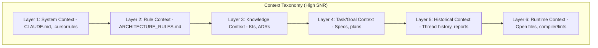
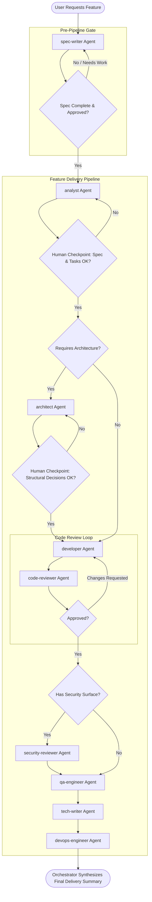
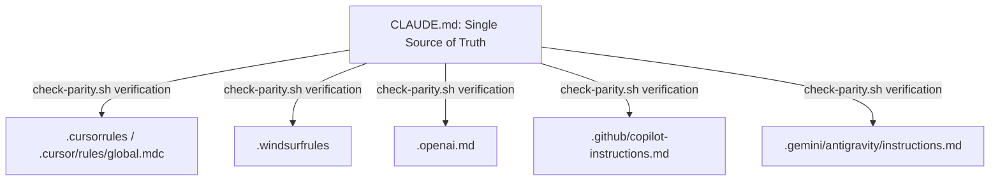

# Agent Workflows, Hooks, and Context Engineering Guide

This guide details the internal mechanics of the **Saturday Multi-Agent Feature Team**, explaining how agents, automated workflows, environment hooks, and context engineering practices operate together.

---

## 1. Context Engineering Framework

Context Engineering is the practice of treating the LLM context window as a premium, finite resource. Unmanaged context leads to **Context Drift** (forgetting constraints) and **Signal-to-Noise Ratio (SNR)** degradation.

### Core Principles

1. **Principle of Least Context**: Load only what is immediately required for the active sub-task. Avoid recursive directory dumps or reading files over 500 lines without line-range constraints.
2. **Proactive Retrieval-Augmented Generation (RAG)**: Scan `<appDataDir>/knowledge/` and `docs/adrs/` for pre-existing solutions before writing code.
3. **State Externalization**: Maintain execution state in external files like [task.md](file:///Users/oscarrieken/Projects/Rieken/ai-assistant-dot-files/docs/features/README.md) and [implementation_plan.md](file:///Users/oscarrieken/Projects/Rieken/ai-assistant-dot-files/docs/features/README.md) instead of keeping them in model memory.
4. **Subagent Boundaries**: Enforce strict isolation. Spawning a subagent creates a clean slate. The orchestrator only consumes the subagent's final report.

### The Context Manifest
The context-engineer agent generates a `.claude/feature-workspace/context-manifest.md` to establish boundaries:
- **Scope & Boundaries**: Defines the component, layers, and Bounded Context.
- **Pinpoint Files**: Up to 10 highly-cohesive files, range-constrained if $>500$ lines.
- **Knowledge/ADRs**: Related documents to load.
- **Pruning Checklist**: Files currently open in the IDE that should be closed.

---

## 2. Multi-Agent Pipeline Workflow

The feature delivery workflow coordinates up to 8 specialized subagents sequentially. Below is the lifecycle of a feature:

### Agent Roles

| Agent | Responsibility | Output Document |
|---|---|---|
| `spec-writer` | Conducts interactive interview, drafts requirements. | `features/feature-name.md` |
| `analyst` | Establishes domain boundaries, tasks, and dictionary terms. | `analysis.md` |
| `architect` | Makes structural design decisions and sets fitness functions. | `architecture-notes.md` |
| `developer` | Implements the code matching clean architecture rules. | `implementation-notes.md` |
| `code-reviewer` | Evaluates against Sandi Metz rules, Fowler smells, and Clean Code. | `code-review-report.md` |
| `security-reviewer` | STRIDE threat modeling, checks input sanitation/secrets/APIs. | `security-report.md` |
| `qa-engineer` | Writes and runs integration, unit, and E2E tests. | `qa-report.md` |
| `tech-writer` | Syncs ADRs, READMEs, diagrams, and domain dictionary. | `docs-report.md` |
| `devops-engineer` | Updates CI pipelines, build tools, and container definitions. | `devops-report.md` |

---

## 3. Platform Hooks & Integrations

To ensure that various AI assistants (Claude, Cursor, Windsurf, OpenAI, Gemini/Antigravity) apply the exact same core craftsman principles, the repository uses platform-specific configuration hooks:

- **Parity Check Hook**: `check-parity.sh` scans all configuration files to ensure they contain critical concepts like:
  - Cyclomatic complexity limits (`< 7`)
  - Minimum test coverage (`85%`)
  - Clean Architecture & SOLID principles
  - Saturday (E2E Playwright/Cucumber) and Sunday (API testing) framework guidelines
- **Deployment Hook**: `scaffold-team.sh` bootstraps any clean workspace with these agents, skills, and configuration files instantly.
